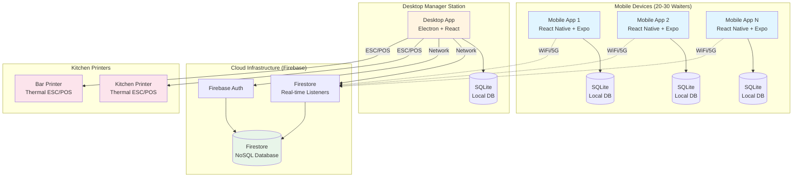
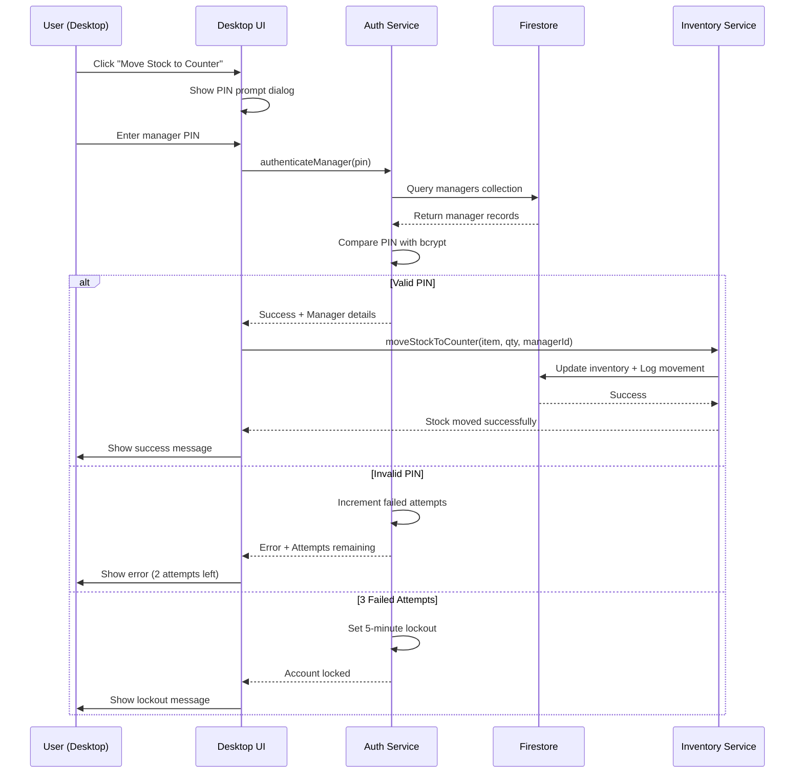
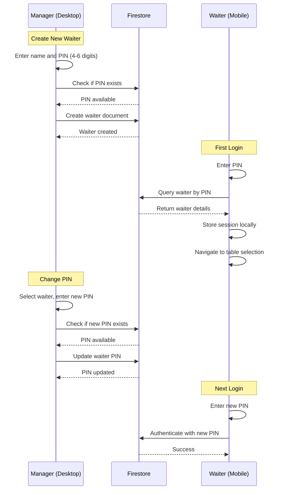
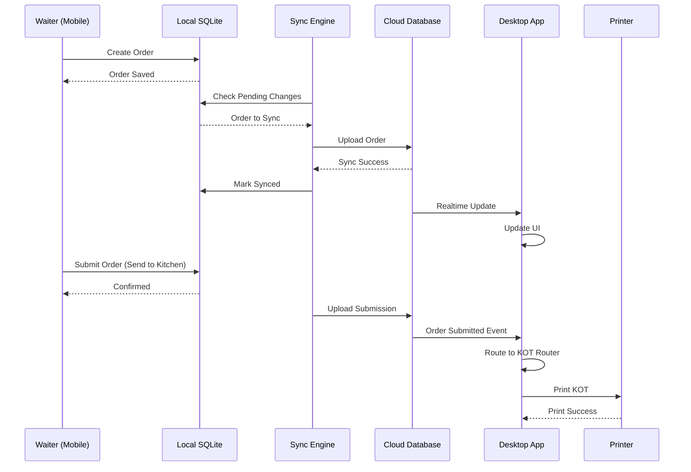
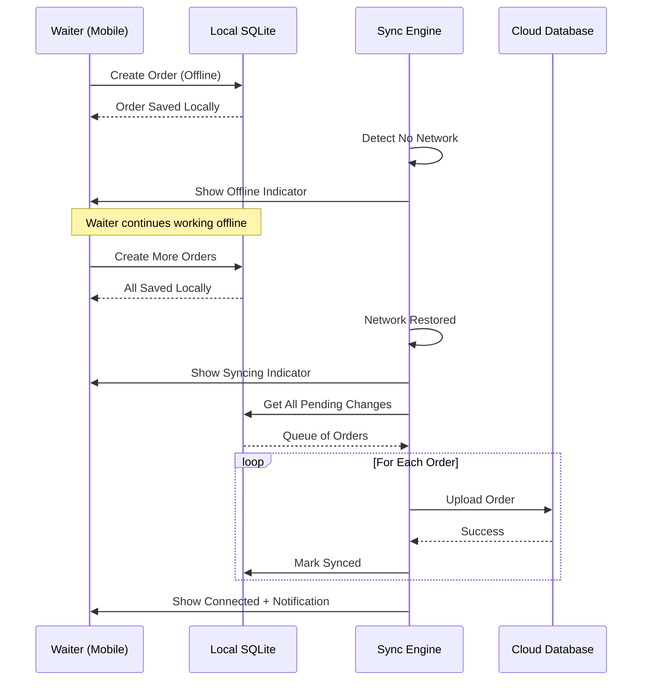
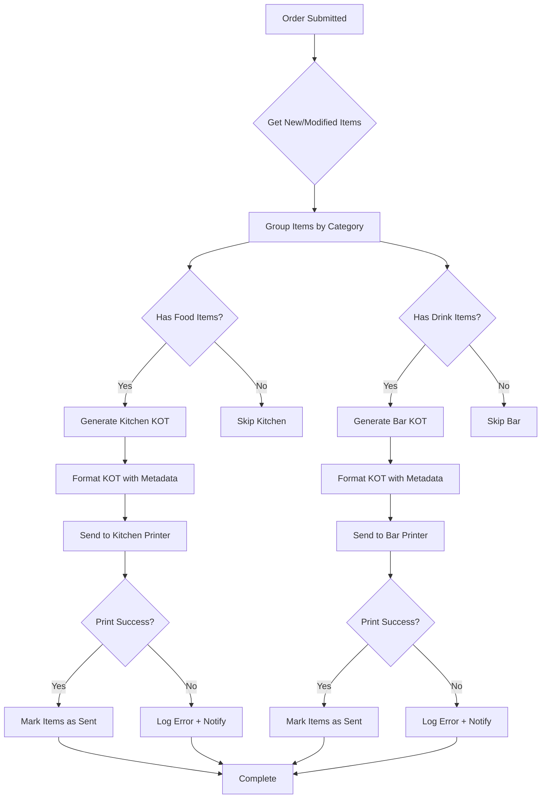

# Design Document: WaiterFlow Mobile Ordering System

## Backend Technology: Firebase

This system uses Firebase as the cloud backend instead of Supabase due to regional availability constraints. Firebase provides:

- Firestore: NoSQL document database with real-time synchronization
- Firebase Authentication: Secure waiter authentication with custom tokens
- Automatic offline persistence and sync with exponential backoff retry
- Generous free tier: 50K reads/day, 20K writes/day, 1GB storage
- Not blocked in India (critical requirement)

## Overview

WaiterFlow is a distributed restaurant ordering system consisting of mobile Android applications for waiters, an Electron desktop application for managers, and cloud-based synchronization infrastructure. The system enables real-time order capture, offline operation, automatic KOT printing, and comprehensive restaurant management.

### System Goals

- Support 20-30 concurrent mobile devices with sub-2-second synchronization
- Enable offline order capture with automatic sync on reconnection
- Route KOTs automatically to kitchen and bar printers based on item category
- Maintain data consistency across distributed devices using last-write-wins conflict resolution
- Provide comprehensive restaurant management including inventory, billing, and reporting
- Support collaborative service model where any waiter can help any table

### Technology Stack

**Mobile Application:**
- React Native with Expo for cross-platform development
- SQLite for local offline storage
- Firebase Firestore for live data synchronization
- React Navigation for screen management

**Desktop Application:**
- Electron for cross-platform desktop support
- React for UI components
- SQLite for local data storage
- Firebase SDK for cloud synchronization

**Cloud Infrastructure:**
- Firebase Firestore for centralized NoSQL data storage
- Firestore Real-time listeners for live data synchronization
- Firebase Authentication for waiter authentication

**Printing:**
- Thermal printer protocol (ESC/POS)
- Network-connected kitchen and bar printers
- Node.js printer driver integration


## Architecture

### System Architecture Diagram



### Architecture Layers

**Presentation Layer:**
- Mobile: React Native screens for table selection, menu browsing, order entry
- Desktop: React components for billing, reporting, menu management, inventory

**Business Logic Layer:**
- Order validation and calculation
- KOT routing logic
- Inventory deduction rules
- Conflict resolution strategies

**Data Synchronization Layer:**
- Sync Engine: Bidirectional data flow between local SQLite and Firestore
- Change tracking: Detect local modifications for upload
- Conflict resolution: Last-write-wins with timestamp comparison
- Offline persistence: Firestore SDK handles automatic offline caching

**Data Persistence Layer:**
- Local SQLite: Offline-first storage on each device
- Cloud Firestore: Source of truth for synchronized state
- Firestore listeners: Push updates to connected clients in real-time

**Integration Layer:**
- Printer drivers: ESC/POS command generation
- Network abstraction: Handle connectivity changes gracefully


## Components and Interfaces

### Mobile Application Components

**AuthenticationScreen**
- Purpose: Waiter login with PIN validation
- Interface:
  ```typescript
  interface AuthenticationScreen {
    onPinEntered(pin: string): Promise<AuthResult>
    validatePinFormat(pin: string): boolean
    navigateToTableSelection(): void
  }
  
  type AuthResult = 
    | { success: true; waiterId: string; waiterName: string }
    | { success: false; error: string }
  ```

**TableSelectionScreen**
- Purpose: Display all tables with status indicators
- Interface:
  ```typescript
  interface TableSelectionScreen {
    loadTables(): Promise<Table[]>
    filterBySection(sectionId: string): Table[]
    onTableSelected(tableId: string): void
    getTableStatus(tableId: string): TableStatus
  }
  
  type TableStatus = 'available' | 'occupied' | 'pending_bill'
  
  interface Table {
    id: string
    name: string
    sectionId: string
    status: TableStatus
    currentOrderId?: string
  }
  ```

**MenuBrowserComponent**
- Purpose: Display menu items with search and category filtering
- Interface:
  ```typescript
  interface MenuBrowserComponent {
    loadMenuItems(): Promise<MenuItem[]>
    searchByName(query: string): MenuItem[]
    filterByCategory(categoryId: string): MenuItem[]
    isOutOfStock(itemId: string): boolean
  }
  
  interface MenuItem {
    id: string
    name: string
    price: number
    categoryId: string
    category: 'food' | 'drink'
    isOutOfStock: boolean
    availableModifiers: Modifier[]
  }
  
  interface Modifier {
    id: string
    name: string
    type: 'spice_level' | 'paid_addon'
    price: number
  }
  ```

**OrderEntryScreen**
- Purpose: Build and modify orders for a table
- Interface:
  ```typescript
  interface OrderEntryScreen {
    addItem(menuItemId: string, quantity: number, modifiers: string[]): void
    updateQuantity(orderItemId: string, newQuantity: number): void
    removeItem(orderItemId: string): void
    calculateTotal(): number
    submitOrder(): Promise<SubmitResult>
    loadExistingOrder(tableId: string): Promise<Order | null>
  }
  
  interface Order {
    id: string
    tableId: string
    waiterId: string
    items: OrderItem[]
    status: 'draft' | 'submitted' | 'completed'
    createdAt: Date
    updatedAt: Date
  }
  
  interface OrderItem {
    id: string
    menuItemId: string
    menuItemName: string
    quantity: number
    basePrice: number
    modifiers: AppliedModifier[]
    totalPrice: number
    sentToKitchen: boolean
  }
  
  interface AppliedModifier {
    modifierId: string
    name: string
    price: number
  }
  ```

**SyncStatusIndicator**
- Purpose: Display current synchronization state
- Interface:
  ```typescript
  interface SyncStatusIndicator {
    getCurrentStatus(): SyncStatus
    onStatusChange(callback: (status: SyncStatus) => void): void
  }
  
  type SyncStatus = 
    | { state: 'connected'; lastSync: Date }
    | { state: 'syncing'; progress: number }
    | { state: 'offline'; pendingChanges: number }
  ```


### Desktop Application Components

**BillingScreen**
- Purpose: Generate bills and process payments
- Interface:
  ```typescript
  interface BillingScreen {
    loadOrderForTable(tableId: string): Promise<Order>
    applyDiscount(discount: Discount): void
    calculateFinalAmount(): number
    processPayment(payment: Payment): Promise<PaymentResult>
    generateBill(): Promise<Bill>
  }
  
  interface Discount {
    type: 'percentage' | 'fixed'
    value: number
  }
  
  interface Payment {
    methods: PaymentMethod[]
  }
  
  interface PaymentMethod {
    type: 'cash' | 'card' | 'upi'
    amount: number
  }
  
  interface Bill {
    id: string
    orderId: string
    subtotal: number
    discount: number
    total: number
    payments: PaymentMethod[]
    isPending: boolean
    customerPhone?: string
    createdAt: Date
  }
  ```

**DesktopOrderEntryScreen**
- Purpose: Create and manage orders from desktop application
- Interface:
  ```typescript
  interface DesktopOrderEntryScreen {
    selectTable(tableId: string): void
    loadMenuItems(): Promise<MenuItem[]>
    addItemToOrder(menuItemId: string, quantity: number, modifiers: string[]): void
    updateQuantity(orderItemId: string, newQuantity: number): void
    removeItem(orderItemId: string): void
    calculateTotal(): number
    sendToKitchen(): Promise<SendToKitchenResult>
    loadExistingOrder(tableId: string): Promise<Order | null>
  }
  
  interface SendToKitchenResult {
    success: boolean
    kitchenKOT?: KOT
    barKOT?: KOT
    errors: string[]
  }
  ```

**MenuManagementScreen**
- Purpose: CRUD operations for menu items
- Interface:
  ```typescript
  interface MenuManagementScreen {
    createMenuItem(item: MenuItemInput): Promise<MenuItem>
    updateMenuItem(id: string, updates: Partial<MenuItemInput>): Promise<MenuItem>
    deleteMenuItem(id: string): Promise<void>
    markOutOfStock(id: string, isOutOfStock: boolean): Promise<void>
    getOutOfStockItems(): Promise<MenuItem[]>
  }
  
  interface MenuItemInput {
    name: string
    price: number
    categoryId: string
    category: 'food' | 'drink'
    availableModifiers: string[]
  }
  ```

**InventoryManagementScreen**
- Purpose: Track and update bar item inventory
- Interface:
  ```typescript
  interface InventoryManagementScreen {
    getInventoryLevels(): Promise<InventoryItem[]>
    updateStock(itemId: string, quantity: number): Promise<void>
    deductStock(itemId: string, quantity: number): Promise<void>
    getAutoOutOfStockItems(): Promise<MenuItem[]>
  }
  
  interface InventoryItem {
    menuItemId: string
    currentQuantity: number
    isBarItem: boolean
    autoOutOfStock: boolean
  }
  ```

**TableManagementScreen**
- Purpose: Manage tables, sections, and table operations
- Interface:
  ```typescript
  interface TableManagementScreen {
    createSection(name: string): Promise<Section>
    createTable(name: string, sectionId: string): Promise<Table>
    updateTable(id: string, updates: Partial<Table>): Promise<Table>
    deleteTable(id: string): Promise<void>
    mergeTables(tableIds: string[]): Promise<Order>
    splitTable(tableId: string, splitConfig: SplitConfig): Promise<Order[]>
    transferTable(fromTableId: string, toTableId: string): Promise<void>
  }
  
  interface Section {
    id: string
    name: string
    tables: Table[]
  }
  
  interface SplitConfig {
    splits: { items: string[] }[]
  }
  ```

**ReportingScreen**
- Purpose: Generate waiter performance and sales reports
- Interface:
  ```typescript
  interface ReportingScreen {
    getWaiterReport(waiterId: string, period: ReportPeriod): Promise<WaiterReport>
    getAllWaitersReport(period: ReportPeriod): Promise<WaiterReport[]>
  }
  
  type ReportPeriod = 'daily' | 'weekly' | 'monthly'
  
  interface WaiterReport {
    waiterId: string
    waiterName: string
    orderCount: number
    totalSales: number
    tableAssignments: string[]
    period: ReportPeriod
  }
  ```


### Core Service Components

**SyncEngine**
- Purpose: Bidirectional synchronization between local and cloud databases
- Interface:
  ```typescript
  interface SyncEngine {
    initialize(deviceId: string): Promise<void>
    startBackgroundSync(intervalMs: number): void
    stopBackgroundSync(): void
    syncNow(): Promise<SyncResult>
    onSyncStatusChange(callback: (status: SyncStatus) => void): void
    resolveConflict(local: Entity, remote: Entity): Entity
  }
  
  interface SyncResult {
    success: boolean
    uploadedChanges: number
    downloadedChanges: number
    conflicts: number
    errors: string[]
  }
  
  interface Entity {
    id: string
    updatedAt: Date
    data: any
  }
  ```

**KOTRouter**
- Purpose: Route order items to appropriate printers
- Interface:
  ```typescript
  interface KOTRouter {
    routeOrder(order: Order, newItems: OrderItem[]): Promise<KOTRoutingResult>
    generateKOT(items: OrderItem[], metadata: KOTMetadata): KOT
    sendToPrinter(kot: KOT, printer: PrinterType): Promise<void>
  }
  
  type PrinterType = 'kitchen' | 'bar'
  
  interface KOTRoutingResult {
    kitchenKOT?: KOT
    barKOT?: KOT
    errors: string[]
  }
  
  interface KOT {
    id: string
    orderNumber: string
    tableNumber: string
    waiterName: string
    items: KOTItem[]
    timestamp: string
    printerType: PrinterType
  }
  
  interface KOTItem {
    name: string
    quantity: number
    modifiers: string[]
    isIncremental: boolean
  }
  
  interface KOTMetadata {
    orderNumber: string
    tableNumber: string
    waiterName: string
    timestamp: Date
  }
  ```

**PrinterDriver**
- Purpose: Generate ESC/POS commands and communicate with thermal printers
- Interface:
  ```typescript
  interface PrinterDriver {
    connect(printerConfig: PrinterConfig): Promise<void>
    disconnect(): Promise<void>
    print(kot: KOT): Promise<PrintResult>
    checkStatus(): Promise<PrinterStatus>
  }
  
  interface PrinterConfig {
    ipAddress: string
    port: number
    type: PrinterType
  }
  
  interface PrintResult {
    success: boolean
    error?: string
  }
  
  type PrinterStatus = 'online' | 'offline' | 'error'
  ```

**ConfigurationParser**
- Purpose: Parse and validate printer configuration files
- Interface:
  ```typescript
  interface ConfigurationParser {
    parse(configFile: string): ParseResult
    print(config: Configuration): string
    validate(config: Configuration): ValidationResult
  }
  
  interface ParseResult {
    success: boolean
    config?: Configuration
    error?: string
  }
  
  interface Configuration {
    kitchenPrinter: PrinterConfig
    barPrinter: PrinterConfig
    syncInterval: number
    offlineRetryAttempts: number
  }
  
  interface ValidationResult {
    valid: boolean
    errors: string[]
  }
  ```

**OrderSerializer**
- Purpose: Serialize and deserialize orders for network transmission
- Interface:
  ```typescript
  interface OrderSerializer {
    serialize(order: Order): SerializeResult
    deserialize(json: string): DeserializeResult
  }
  
  interface SerializeResult {
    success: boolean
    json?: string
    error?: string
  }
  
  interface DeserializeResult {
    success: boolean
    order?: Order
    error?: string
  }
  ```


## Waiter PIN Management

### Overview

Waiter PINs are managed exclusively through the desktop application by managers. Waiters cannot create or modify their own PINs. This ensures centralized control and security.

## Manager PIN Management

### Overview

Manager PINs provide elevated privileges for sensitive operations like inventory movements. Managers can set their own PINs and must authenticate before performing protected actions.

### Manager vs Waiter PINs

| Feature | Waiter PIN | Manager PIN |
|---------|-----------|-------------|
| Purpose | Order taking authentication | Authorize sensitive operations |
| Who manages | Manager creates/updates | Self-managed by manager |
| Storage | Plain text (acceptable) | Bcrypt hashed (secure) |
| Used for | Mobile app login | Inventory movements, critical operations |
| Lockout | No lockout | 3 attempts = 5 min lockout |
| Audit trail | Order attribution | Inventory movement logs |

### Protected Operations Requiring Manager PIN

1. **Inventory Movements**
   - Moving stock from godown to counter
   - Manual inventory adjustments
   - Stock corrections

2. **Future Protected Operations** (can be added):
   - Large discounts (>20%)
   - Voiding completed orders
   - Deleting menu items
   - Changing prices during service

### Manager Authentication Flow



### Manager PIN Setup

**Initial Manager Creation (Desktop App):**
```typescript
// Create first manager account
async function createManager(name: string, pin: string, role: string): Promise<CreateManagerResult> {
  try {
    // Validate PIN format (4-6 digits)
    if (!/^\d{4,6}$/.test(pin)) {
      return { success: false, error: 'PIN must be 4-6 digits' }
    }
    
    // Hash PIN with bcrypt
    const hashedPin = await bcrypt.hash(pin, 10)
    
    // Create manager document
    const managerRef = await addDoc(collection(firestore, 'managers'), {
      name,
      pin: hashedPin,
      role, // 'owner', 'manager', 'supervisor'
      isActive: true,
      createdAt: serverTimestamp(),
      updatedAt: serverTimestamp()
    })
    
    return { 
      success: true, 
      managerId: managerRef.id,
      message: `Manager ${name} created successfully`
    }
  } catch (error) {
    return { success: false, error: error.message }
  }
}

// Manager changes their own PIN
async function changeManagerPin(managerId: string, oldPin: string, newPin: string): Promise<UpdateResult> {
  try {
    // Validate new PIN format
    if (!/^\d{4,6}$/.test(newPin)) {
      return { success: false, error: 'PIN must be 4-6 digits' }
    }
    
    // Verify old PIN
    const managerRef = doc(firestore, 'managers', managerId)
    const managerDoc = await getDoc(managerRef)
    
    if (!managerDoc.exists()) {
      return { success: false, error: 'Manager not found' }
    }
    
    const manager = managerDoc.data()
    const isOldPinValid = await bcrypt.compare(oldPin, manager.pin)
    
    if (!isOldPinValid) {
      return { success: false, error: 'Current PIN is incorrect' }
    }
    
    // Hash and update new PIN
    const hashedNewPin = await bcrypt.hash(newPin, 10)
    await updateDoc(managerRef, {
      pin: hashedNewPin,
      updatedAt: serverTimestamp()
    })
    
    return { 
      success: true, 
      message: 'PIN updated successfully'
    }
  } catch (error) {
    return { success: false, error: error.message }
  }
}
```

### Inventory Movement with Manager Authentication

**Desktop UI Flow:**

1. User clicks "Move Stock to Counter" button
2. System shows PIN prompt dialog:
```
┌─────────────────────────────────────┐
│  Manager Authentication Required [×] │
├─────────────────────────────────────┤
│                                      │
│  Moving 50 units of "Kingfisher"    │
│  from Godown to Counter              │
│                                      │
│  Enter Manager PIN:                  │
│  [●●●●●●]                            │
│                                      │
│  Reason (optional):                  │
│  [_____________________________]     │
│                                      │
│         [Cancel]  [Authorize]        │
│                                      │
└─────────────────────────────────────┘
```

3. Manager enters PIN
4. System validates and processes
5. Success: Stock moved + audit log created
6. Failure: Error shown with attempts remaining

**Inventory Movement Audit Log:**

All movements are logged with full details:
```typescript
{
  id: "mov_123456",
  menuItemId: "item_789",
  menuItemName: "Kingfisher Beer",
  movementType: "godown_to_counter",
  quantity: 50,
  fromLocation: "godown",
  toLocation: "counter",
  authorizedBy: "mgr_001",
  managerName: "Rajesh Kumar",
  reason: "Restocking for evening rush",
  timestamp: "2026-03-03T18:30:00Z"
}
```

### Security Features

**PIN Hashing:**
- Manager PINs hashed with bcrypt (cost factor 10)
- Never stored or transmitted in plain text
- Comparison done server-side

**Lockout Protection:**
- 3 failed attempts = 5 minute lockout
- Lockout timer stored locally (per device)
- Automatic reset after successful authentication

**Audit Trail:**
- Every inventory movement logged
- Includes: manager ID, name, timestamp, reason
- Immutable log (no deletion allowed)
- Queryable by item, date range, manager

**Role-Based Access:**
- Owner: Full access to all operations
- Manager: Inventory movements, reports
- Supervisor: Limited inventory operations
- Roles can be extended in future

### Desktop UI for Manager Management

**Manager Settings Screen:**
```
┌─────────────────────────────────────────────────────┐
│  Manager Accounts                  [+ Add Manager]   │
├─────────────────────────────────────────────────────┤
│                                                       │
│  ┌───────────────────────────────────────────────┐  │
│  │ Name           Role        Status    Actions   │  │
│  ├───────────────────────────────────────────────┤  │
│  │ Rajesh Kumar   Owner       Active    [⋮]      │  │
│  │ Priya Sharma   Manager     Active    [⋮]      │  │
│  │ Amit Patel     Supervisor  Active    [⋮]      │  │
│  └───────────────────────────────────────────────┘  │
│                                                       │
│  My Account                                           │
│  ┌───────────────────────────────────────────────┐  │
│  │ Name: Rajesh Kumar                             │  │
│  │ Role: Owner                                    │  │
│  │                                                │  │
│  │ [Change My PIN]                                │  │
│  └───────────────────────────────────────────────┘  │
│                                                       │
└─────────────────────────────────────────────────────┘
```

**Inventory Movement History:**
```
┌─────────────────────────────────────────────────────┐
│  Inventory Movement History                          │
├─────────────────────────────────────────────────────┤
│                                                       │
│  Filter: [All Items ▼]  [Last 7 Days ▼]  [Search]   │
│                                                       │
│  ┌───────────────────────────────────────────────┐  │
│  │ Date/Time    Item         Qty  Manager  Reason│  │
│  ├───────────────────────────────────────────────┤  │
│  │ 03/03 18:30  Kingfisher   +50  Rajesh   Rush  │  │
│  │ 03/03 14:15  Chicken      +20  Priya    Stock │  │
│  │ 03/02 19:45  Vodka        +30  Rajesh   Event │  │
│  │ 03/02 12:00  Paneer       +15  Amit     Lunch │  │
│  └───────────────────────────────────────────────┘  │
│                                                       │
│  [Export to CSV]                                      │
│                                                       │
└─────────────────────────────────────────────────────┘
```

### Best Practices

**For Managers:**
- Use 6-digit PINs for better security
- Change PIN every 3 months
- Don't share PIN with staff
- Always provide reason for inventory movements
- Review movement logs weekly

**For System Administrators:**
- Create separate manager accounts (don't share)
- Assign appropriate roles based on responsibility
- Regularly audit inventory movement logs
- Backup manager credentials securely
- Deactivate accounts when managers leave

### Implementation Notes

**Desktop App:**
- Add "Manager Accounts" section in Settings
- Implement PIN prompt dialog component
- Add inventory movement history viewer
- Use Firebase Admin SDK for manager operations

**Security:**
- Install bcrypt: `npm install bcrypt`
- Hash PINs before storing
- Implement lockout logic in auth service
- Store lockout state in localStorage

**Firestore Security Rules:**
```javascript
// Managers collection - read only for authenticated users
match /managers/{managerId} {
  allow read: if request.auth != null;
  allow write: if false; // Only admin SDK can write
}

// Inventory movements - read only, write via admin SDK
match /inventoryMovements/{movementId} {
  allow read: if request.auth != null;
  allow write: if false; // Only admin SDK can write
}
```

### Waiter PIN Management

### PIN Management Workflow



### PIN Management Features

**Desktop Application (Manager Only):**

1. **Create Waiter**
   - Manager enters waiter name and assigns a PIN (4-6 digits)
   - System validates PIN format and uniqueness
   - Waiter document created in Firestore
   - Manager can print/share PIN with waiter

2. **Update PIN**
   - Manager selects waiter from list
   - Enters new PIN
   - System validates and updates
   - Old PIN immediately becomes invalid

3. **Deactivate Waiter**
   - Manager can deactivate waiter (e.g., employee left)
   - Waiter cannot login with deactivated account
   - Historical data (orders, sales) remains intact

4. **Reactivate Waiter**
   - Manager can reactivate previously deactivated waiter
   - Same PIN can be reused

5. **View All Waiters**
   - List shows: Name, PIN, Active status, Created date
   - Manager can search/filter waiters

**Mobile Application (Waiter):**

1. **Login**
   - Waiter enters PIN on mobile app
   - System validates against Firestore
   - Session stored locally (no need to re-enter PIN)

2. **Logout**
   - Waiter can manually logout
   - Clears local session
   - Requires PIN re-entry on next use

3. **Session Persistence**
   - PIN entered once, stays logged in
   - Session survives app restarts
   - Only cleared on explicit logout

### Security Considerations

**PIN Storage:**
- PINs stored as plain text in Firestore (acceptable for this use case)
- Alternative: Hash PINs with bcrypt if higher security needed
- Firestore security rules prevent unauthorized access

**PIN Uniqueness:**
- Each PIN must be unique across all waiters
- System enforces uniqueness at creation and update

**Access Control:**
- Only desktop app (with admin privileges) can manage PINs
- Mobile app can only read waiter data for authentication
- Firestore security rules enforce this separation

**Session Management:**
- Mobile app stores waiterId and waiterName locally
- No PIN stored on device
- Session cleared on logout

### Desktop UI for PIN Management

**Waiter Management Screen:**
```
┌─────────────────────────────────────────────────────┐
│  Waiter Management                    [+ Add Waiter] │
├─────────────────────────────────────────────────────┤
│                                                       │
│  Search: [____________]  Filter: [All ▼]             │
│                                                       │
│  ┌───────────────────────────────────────────────┐  │
│  │ Name          PIN     Status    Actions        │  │
│  ├───────────────────────────────────────────────┤  │
│  │ Rajesh Kumar  1234    Active    [Edit] [⋮]    │  │
│  │ Priya Sharma  5678    Active    [Edit] [⋮]    │  │
│  │ Amit Patel    9012    Inactive  [Edit] [⋮]    │  │
│  │ Neha Singh    3456    Active    [Edit] [⋮]    │  │
│  └───────────────────────────────────────────────┘  │
│                                                       │
└─────────────────────────────────────────────────────┘
```

**Add/Edit Waiter Dialog:**
```
┌─────────────────────────────────────┐
│  Add New Waiter                  [×] │
├─────────────────────────────────────┤
│                                      │
│  Name: [_____________________]       │
│                                      │
│  PIN:  [______]  (4-6 digits)        │
│                                      │
│  Status: ☑ Active                    │
│                                      │
│         [Cancel]  [Save Waiter]      │
│                                      │
└─────────────────────────────────────┘
```

### Mobile UI for PIN Entry

**Login Screen:**
```
┌─────────────────────────────────────┐
│                                      │
│         🍽️ WaiterFlow                │
│                                      │
│      Enter Your PIN                  │
│                                      │
│      ┌─────────────────┐             │
│      │  [●] [●] [●] [●] │             │
│      └─────────────────┘             │
│                                      │
│      ┌───┬───┬───┐                   │
│      │ 1 │ 2 │ 3 │                   │
│      ├───┼───┼───┤                   │
│      │ 4 │ 5 │ 6 │                   │
│      ├───┼───┼───┤                   │
│      │ 7 │ 8 │ 9 │                   │
│      ├───┼───┼───┤                   │
│      │   │ 0 │ ⌫ │                   │
│      └───┴───┴───┘                   │
│                                      │
│      [Login]                         │
│                                      │
└─────────────────────────────────────┘
```

### PIN Reset Process

If a waiter forgets their PIN:

1. Waiter contacts manager
2. Manager opens desktop app
3. Manager finds waiter in list
4. Manager clicks "Edit" and assigns new PIN
5. Manager shares new PIN with waiter
6. Waiter logs in with new PIN

**No self-service PIN reset** - maintains security and manager control.

### Best Practices

**For Managers:**
- Use unique PINs for each waiter (don't reuse)
- Keep a secure record of PINs (encrypted file or password manager)
- Change PINs periodically (e.g., every 3 months)
- Deactivate waiters immediately when they leave
- Use 6-digit PINs for better security

**For Waiters:**
- Memorize your PIN (don't write it down)
- Don't share your PIN with other waiters
- Logout when leaving device unattended
- Report lost/stolen device to manager immediately

### Implementation Notes

**Desktop App:**
- Add "Waiter Management" menu item in Settings
- Use Firebase Admin SDK for privileged operations
- Validate PIN format client-side before submission
- Show success/error notifications

**Mobile App:**
- Implement numeric keypad for PIN entry
- Mask PIN digits as they're entered
- Clear PIN input on authentication failure
- Store session in AsyncStorage (React Native)

**Firebase Security Rules:**
```javascript
// Only allow reads for authentication
match /waiters/{waiterId} {
  allow read: if request.auth != null;
  allow write: if false; // Only admin SDK can write
}
```

## Data Models

### Database Schema

#### Firebase Firestore Collections

Firestore uses a NoSQL document-based structure. Each collection contains documents with fields.

**managers** collection:
```typescript
interface Manager {
  id: string // Document ID
  name: string
  pin: string // 4-6 digits, hashed with bcrypt
  email?: string
  role: 'owner' | 'manager' | 'supervisor'
  isActive: boolean
  createdAt: Timestamp
  updatedAt: Timestamp
}
// Index: pin (for authentication)
```

**waiters** collection:
```typescript
interface Waiter {
  id: string // Document ID
  name: string
  pin: string // Indexed for quick lookup
  isActive: boolean
  createdAt: Timestamp
  updatedAt: Timestamp
}
```

**sections** collection:
```typescript
interface Section {
  id: string // Document ID
  name: string
  createdAt: Timestamp
  updatedAt: Timestamp
}
```

**tables** collection:
```typescript
interface Table {
  id: string // Document ID
  name: string
  sectionId: string // Reference to sections collection
  status: 'available' | 'occupied' | 'pending_bill'
  currentOrderId?: string
  createdAt: Timestamp
  updatedAt: Timestamp
}
// Indexes: sectionId, status
```

**menuCategories** collection:
```typescript
interface MenuCategory {
  id: string // Document ID
  name: string
  displayOrder: number
  createdAt: Timestamp
  updatedAt: Timestamp
}
```

**menuItems** collection:
```typescript
interface MenuItem {
  id: string // Document ID
  name: string
  price: number
  categoryId: string // Reference to menuCategories
  itemCategory: 'food' | 'drink'
  isOutOfStock: boolean
  isBarItem: boolean
  availableModifierIds: string[] // Array of modifier IDs
  createdAt: Timestamp
  updatedAt: Timestamp
}
// Indexes: categoryId, isOutOfStock, itemCategory
```

**modifiers** collection:
```typescript
interface Modifier {
  id: string // Document ID
  name: string
  type: 'spice_level' | 'paid_addon'
  price: number
  createdAt: Timestamp
  updatedAt: Timestamp
}
```

**inventory** collection:
```typescript
interface Inventory {
  id: string // Document ID (same as menuItemId)
  menuItemId: string
  quantity: number
  autoOutOfStock: boolean
  updatedAt: Timestamp
}
```

**inventoryMovements** collection:
```typescript
interface InventoryMovement {
  id: string // Document ID
  menuItemId: string
  menuItemName: string
  movementType: 'godown_to_counter' | 'adjustment' | 'sale'
  quantity: number
  fromLocation: 'godown' | 'counter'
  toLocation: 'counter' | 'sold'
  authorizedBy: string // Manager ID
  managerName: string
  reason?: string
  timestamp: Timestamp
}
// Indexes: menuItemId, authorizedBy, timestamp
```

**orders** collection:
```typescript
interface Order {
  id: string // Document ID
  orderNumber: string // Indexed for quick lookup
  tableId: string
  waiterId: string
  status: 'draft' | 'submitted' | 'completed' | 'cancelled'
  createdAt: Timestamp
  updatedAt: Timestamp
}
// Indexes: tableId, waiterId, status, orderNumber
```

**orderItems** subcollection under orders:
```typescript
// Path: orders/{orderId}/items/{itemId}
interface OrderItem {
  id: string // Document ID
  menuItemId: string
  menuItemName: string
  quantity: number
  basePrice: number
  totalPrice: number
  sentToKitchen: boolean
  modifiers: AppliedModifier[]
  category: 'food' | 'drink'
  createdAt: Timestamp
  updatedAt: Timestamp
}

interface AppliedModifier {
  modifierId: string
  name: string
  price: number
}
```

**kots** collection:
```typescript
interface KOT {
  id: string // Document ID
  orderId: string
  kotNumber: string
  printerType: 'kitchen' | 'bar'
  items: KOTItem[]
  printedAt: Timestamp
}

interface KOTItem {
  orderItemId: string
  itemName: string
  quantity: number
  modifiers: string
  isIncremental: boolean
}
// Index: orderId
```

**bills** collection:
```typescript
interface Bill {
  id: string // Document ID
  billNumber: string // Indexed
  orderId: string
  subtotal: number
  discountType?: 'percentage' | 'fixed'
  discountValue: number
  discountAmount: number
  total: number
  isPending: boolean
  customerPhone?: string
  customerName?: string
  payments: Payment[]
  createdAt: Timestamp
  updatedAt: Timestamp
}

interface Payment {
  type: 'cash' | 'card' | 'upi'
  amount: number
}
// Indexes: customerPhone, isPending, billNumber
```

**customers** collection:
```typescript
interface Customer {
  id: string // Document ID
  phone: string // Indexed (unique)
  name?: string
  createdAt: Timestamp
  updatedAt: Timestamp
}
// Index: phone
```

**syncMetadata** collection:
```typescript
interface SyncMetadata {
  id: string // Document ID (deviceId)
  deviceId: string
  lastSyncAt: Timestamp
  pendingChanges: number
}
```

**Firestore Security Rules:**
```javascript
rules_version = '2';
service cloud.firestore {
  match /databases/{database}/documents {
    // Helper functions
    function isAuthenticated() {
      return request.auth != null;
    }
    
    function isWaiter() {
      return isAuthenticated() && 
             exists(/databases/$(database)/documents/waiters/$(request.auth.uid));
    }
    
    // Waiters collection - read only for authenticated users
    match /waiters/{waiterId} {
      allow read: if isAuthenticated();
      allow write: if false; // Only admin SDK can write
    }
    
    // Tables - read/write for authenticated waiters
    match /tables/{tableId} {
      allow read, write: if isWaiter();
    }
    
    // Menu items - read for waiters, write restricted
    match /menuItems/{itemId} {
      allow read: if isWaiter();
      allow write: if false; // Desktop app uses admin SDK
    }
    
    // Orders - any waiter can read/write any order (collaborative service)
    match /orders/{orderId} {
      allow read: if isAuthenticated();
      allow create: if isWaiter();
      allow update: if isWaiter();
      allow delete: if false; // Orders should not be deleted
      
      // Order items subcollection - any waiter can modify
      match /items/{itemId} {
        allow read: if isAuthenticated();
        allow write: if isWaiter();
      }
    }
    
    // Bills - read for waiters, write restricted
    match /bills/{billId} {
      allow read: if isWaiter();
      allow write: if false; // Desktop app uses admin SDK
    }
    
    // Other collections follow similar patterns
    match /{document=**} {
      allow read, write: if isWaiter();
    }
  }
}
```


#### SQLite Local Schema (Mobile & Desktop)

The local SQLite schema mirrors the cloud schema with additional sync tracking:

```sql
-- All tables from cloud schema plus:

-- Local sync queue table
CREATE TABLE sync_queue (
  id INTEGER PRIMARY KEY AUTOINCREMENT,
  entity_type VARCHAR(50) NOT NULL,
  entity_id VARCHAR(100) NOT NULL,
  operation VARCHAR(20) NOT NULL,
  data TEXT NOT NULL,
  created_at INTEGER NOT NULL,
  synced BOOLEAN DEFAULT 0,
  CONSTRAINT valid_operation CHECK (operation IN ('insert', 'update', 'delete'))
);

-- Local device info
CREATE TABLE device_info (
  key VARCHAR(50) PRIMARY KEY,
  value TEXT NOT NULL
);

-- Indexes
CREATE INDEX idx_sync_queue_synced ON sync_queue(synced);
CREATE INDEX idx_sync_queue_created ON sync_queue(created_at);
```

### Data Flow Diagrams

#### Order Creation and Synchronization Flow



#### Offline Order Capture Flow




#### KOT Routing Logic Flow



### API Contracts

#### Firebase Firestore Real-time Listeners

**Orders Listener:**
```typescript
import { collection, onSnapshot, query, where } from 'firebase/firestore'

// Subscribe to order changes
const ordersRef = collection(firestore, 'orders')
const unsubscribe = onSnapshot(ordersRef, (snapshot) => {
  snapshot.docChanges().forEach((change) => {
    if (change.type === 'added') {
      handleOrderAdded(change.doc.data())
    } else if (change.type === 'modified') {
      handleOrderModified(change.doc.data())
    } else if (change.type === 'removed') {
      handleOrderRemoved(change.doc.data())
    }
  })
})

// Cleanup
// unsubscribe()
```

**Menu Items Listener:**
```typescript
// Subscribe to menu changes
const menuItemsRef = collection(firestore, 'menuItems')
const unsubscribe = onSnapshot(menuItemsRef, (snapshot) => {
  snapshot.docChanges().forEach((change) => {
    handleMenuChange(change.type, change.doc.data())
  })
})
```

**Tables Listener:**
```typescript
// Subscribe to table status changes
const tablesRef = collection(firestore, 'tables')
const unsubscribe = onSnapshot(tablesRef, (snapshot) => {
  snapshot.docChanges().forEach((change) => {
    if (change.type === 'modified') {
      handleTableStatusChange(change.doc.data())
    }
  })
})
```

**Specific Order Listener (with subcollection):**
```typescript
// Listen to specific order and its items
const orderRef = doc(firestore, 'orders', orderId)
const orderItemsRef = collection(orderRef, 'items')

const unsubOrder = onSnapshot(orderRef, (doc) => {
  handleOrderUpdate(doc.data())
})

const unsubItems = onSnapshot(orderItemsRef, (snapshot) => {
  const items = snapshot.docs.map(doc => doc.data())
  handleOrderItemsUpdate(items)
})
```

#### Firebase SDK Operations

**Authentication:**
```typescript
import { signInWithCustomToken } from 'firebase/auth'
import { collection, query, where, getDocs } from 'firebase/firestore'

// Waiter login (mobile app)
async function authenticateWaiter(pin: string): Promise<AuthResult> {
  try {
    // Query waiters collection for matching PIN
    const waitersRef = collection(firestore, 'waiters')
    const q = query(
      waitersRef,
      where('pin', '==', pin),
      where('isActive', '==', true)
    )
    
    const snapshot = await getDocs(q)
    
    if (snapshot.empty) {
      return { success: false, error: 'Invalid PIN' }
    }
    
    const waiterDoc = snapshot.docs[0]
    const waiter = waiterDoc.data()
    
    // Create custom token for this waiter (server-side)
    const customToken = await createCustomToken(waiterDoc.id)
    
    // Sign in with custom token
    await signInWithCustomToken(auth, customToken)
    
    // Store session locally
    await AsyncStorage.setItem('waiterId', waiterDoc.id)
    await AsyncStorage.setItem('waiterName', waiter.name)
    
    return { 
      success: true, 
      waiterId: waiterDoc.id, 
      waiterName: waiter.name 
    }
  } catch (error) {
    return { success: false, error: error.message }
  }
}
```

**Waiter PIN Management (Desktop App - Manager Only):**
```typescript
import { collection, addDoc, updateDoc, doc, serverTimestamp } from 'firebase/firestore'
import { getAuth } from 'firebase-admin/auth'
import * as crypto from 'crypto'

// Create new waiter with PIN (Desktop - Admin SDK)
async function createWaiter(name: string, pin: string): Promise<CreateWaiterResult> {
  try {
    // Validate PIN format (4-6 digits)
    if (!/^\d{4,6}$/.test(pin)) {
      return { success: false, error: 'PIN must be 4-6 digits' }
    }
    
    // Check if PIN already exists
    const existingWaiter = await getDocs(
      query(collection(firestore, 'waiters'), where('pin', '==', pin))
    )
    
    if (!existingWaiter.empty) {
      return { success: false, error: 'PIN already in use' }
    }
    
    // Create waiter document
    const waiterRef = await addDoc(collection(firestore, 'waiters'), {
      name,
      pin,
      isActive: true,
      createdAt: serverTimestamp(),
      updatedAt: serverTimestamp()
    })
    
    return { 
      success: true, 
      waiterId: waiterRef.id,
      message: `Waiter ${name} created with PIN ${pin}`
    }
  } catch (error) {
    return { success: false, error: error.message }
  }
}

// Update waiter PIN (Desktop - Admin SDK)
async function updateWaiterPin(waiterId: string, newPin: string): Promise<UpdateResult> {
  try {
    // Validate PIN format
    if (!/^\d{4,6}$/.test(newPin)) {
      return { success: false, error: 'PIN must be 4-6 digits' }
    }
    
    // Check if new PIN already exists (for different waiter)
    const existingWaiter = await getDocs(
      query(collection(firestore, 'waiters'), where('pin', '==', newPin))
    )
    
    if (!existingWaiter.empty && existingWaiter.docs[0].id !== waiterId) {
      return { success: false, error: 'PIN already in use by another waiter' }
    }
    
    // Update PIN
    const waiterRef = doc(firestore, 'waiters', waiterId)
    await updateDoc(waiterRef, {
      pin: newPin,
      updatedAt: serverTimestamp()
    })
    
    return { 
      success: true, 
      message: 'PIN updated successfully'
    }
  } catch (error) {
    return { success: false, error: error.message }
  }
}

// Deactivate waiter (Desktop - Admin SDK)
async function deactivateWaiter(waiterId: string): Promise<UpdateResult> {
  try {
    const waiterRef = doc(firestore, 'waiters', waiterId)
    await updateDoc(waiterRef, {
      isActive: false,
      updatedAt: serverTimestamp()
    })
    
    return { 
      success: true, 
      message: 'Waiter deactivated successfully'
    }
  } catch (error) {
    return { success: false, error: error.message }
  }
}

// Reactivate waiter (Desktop - Admin SDK)
async function reactivateWaiter(waiterId: string): Promise<UpdateResult> {
  try {
    const waiterRef = doc(firestore, 'waiters', waiterId)
    await updateDoc(waiterRef, {
      isActive: true,
      updatedAt: serverTimestamp()
    })
    
    return { 
      success: true, 
      message: 'Waiter reactivated successfully'
    }
  } catch (error) {
    return { success: false, error: error.message }
  }
}

// List all waiters (Desktop)
async function listWaiters(): Promise<Waiter[]> {
  const waitersRef = collection(firestore, 'waiters')
  const snapshot = await getDocs(waitersRef)
  
  return snapshot.docs.map(doc => ({
    id: doc.id,
    ...doc.data()
  })) as Waiter[]
}
```

**Order Operations:**
```typescript
import { doc, setDoc, collection, addDoc, updateDoc, serverTimestamp } from 'firebase/firestore'

// Create order (any waiter can create)
async function createOrder(order: OrderInput): Promise<Order> {
  try {
    const ordersRef = collection(firestore, 'orders')
    const docRef = await addDoc(ordersRef, {
      orderNumber: order.orderNumber,
      tableId: order.tableId,
      waiterId: order.waiterId, // Tracks who created it
      status: 'draft',
      createdAt: serverTimestamp(),
      updatedAt: serverTimestamp()
    })
    
    return { id: docRef.id, ...order }
  } catch (error) {
    throw new Error(error.message)
  }
}

// Add order items (any waiter can add to any order)
async function addOrderItems(orderId: string, items: OrderItemInput[]): Promise<OrderItem[]> {
  try {
    const orderItemsRef = collection(firestore, 'orders', orderId, 'items')
    const addedItems: OrderItem[] = []
    
    for (const item of items) {
      const docRef = await addDoc(orderItemsRef, {
        ...item,
        createdAt: serverTimestamp(),
        updatedAt: serverTimestamp()
      })
      addedItems.push({ id: docRef.id, ...item })
    }
    
    return addedItems
  } catch (error) {
    throw new Error(error.message)
  }
}

// Update order status (any waiter can update any order)
async function updateOrderStatus(orderId: string, status: string): Promise<void> {
  try {
    const orderRef = doc(firestore, 'orders', orderId)
    await updateDoc(orderRef, {
      status,
      updatedAt: serverTimestamp()
    })
  } catch (error) {
    throw new Error(error.message)
  }
}

// Note: waiterId field tracks who originally created the order,
// but any waiter can modify it (collaborative restaurant service)
```

**Menu Operations:**
```typescript
import { collection, getDocs, doc, updateDoc, query, orderBy } from 'firebase/firestore'

// Get all menu items
async function getMenuItems(): Promise<MenuItem[]> {
  try {
    const menuItemsRef = collection(firestore, 'menuItems')
    const q = query(menuItemsRef, orderBy('name'))
    const snapshot = await getDocs(q)
    
    const items = snapshot.docs.map(doc => ({
      id: doc.id,
      ...doc.data()
    })) as MenuItem[]
    
    // Fetch modifiers for each item
    for (const item of items) {
      if (item.availableModifierIds?.length > 0) {
        item.modifiers = await getModifiersByIds(item.availableModifierIds)
      }
    }
    
    return items
  } catch (error) {
    throw new Error(error.message)
  }
}

// Update out of stock status
async function updateOutOfStock(itemId: string, isOutOfStock: boolean): Promise<void> {
  try {
    const itemRef = doc(firestore, 'menuItems', itemId)
    await updateDoc(itemRef, {
      isOutOfStock,
      updatedAt: serverTimestamp()
    })
  } catch (error) {
    throw new Error(error.message)
  }
}
```

**Inventory Operations:**
```typescript
import { doc, getDoc, updateDoc, runTransaction } from 'firebase/firestore'

// Deduct inventory (using transaction for atomicity)
async function deductInventory(itemId: string, quantity: number): Promise<void> {
  try {
    await runTransaction(firestore, async (transaction) => {
      const inventoryRef = doc(firestore, 'inventory', itemId)
      const inventoryDoc = await transaction.get(inventoryRef)
      
      if (!inventoryDoc.exists()) {
        throw new Error('Inventory record not found')
      }
      
      const currentQuantity = inventoryDoc.data().quantity
      const newQuantity = currentQuantity - quantity
      
      transaction.update(inventoryRef, {
        quantity: newQuantity,
        updatedAt: serverTimestamp()
      })
      
      // Auto mark out of stock if quantity reaches zero
      if (newQuantity <= 0) {
        const menuItemRef = doc(firestore, 'menuItems', itemId)
        transaction.update(menuItemRef, {
          isOutOfStock: true,
          updatedAt: serverTimestamp()
        })
      }
    })
  } catch (error) {
    throw new Error(error.message)
  }
}

// Move stock from godown to counter (requires manager PIN)
async function moveStockToCounter(
  itemId: string, 
  quantity: number, 
  managerPin: string,
  reason?: string
): Promise<MoveStockResult> {
  try {
    // 1. Authenticate manager
    const manager = await authenticateManager(managerPin)
    if (!manager.success) {
      return { 
        success: false, 
        error: 'Invalid manager PIN',
        attemptsRemaining: manager.attemptsRemaining 
      }
    }
    
    // 2. Update inventory with transaction
    await runTransaction(firestore, async (transaction) => {
      const inventoryRef = doc(firestore, 'inventory', itemId)
      const menuItemRef = doc(firestore, 'menuItems', itemId)
      
      const inventoryDoc = await transaction.get(inventoryRef)
      const menuItemDoc = await transaction.get(menuItemRef)
      
      if (!inventoryDoc.exists() || !menuItemDoc.exists()) {
        throw new Error('Item not found')
      }
      
      const currentQuantity = inventoryDoc.data().quantity
      const newQuantity = currentQuantity + quantity
      
      // Update inventory
      transaction.update(inventoryRef, {
        quantity: newQuantity,
        updatedAt: serverTimestamp()
      })
      
      // Mark as in-stock if quantity > 0
      if (newQuantity > 0) {
        transaction.update(menuItemRef, {
          isOutOfStock: false,
          updatedAt: serverTimestamp()
        })
      }
      
      // Log inventory movement
      const movementRef = doc(collection(firestore, 'inventoryMovements'))
      transaction.set(movementRef, {
        menuItemId: itemId,
        menuItemName: menuItemDoc.data().name,
        movementType: 'godown_to_counter',
        quantity,
        fromLocation: 'godown',
        toLocation: 'counter',
        authorizedBy: manager.managerId,
        managerName: manager.managerName,
        reason: reason || '',
        timestamp: serverTimestamp()
      })
    })
    
    return { 
      success: true, 
      message: `Successfully moved ${quantity} units to counter` 
    }
  } catch (error) {
    return { success: false, error: error.message }
  }
}

// Authenticate manager by PIN
async function authenticateManager(pin: string): Promise<ManagerAuthResult> {
  try {
    // Check failed attempts
    const failedAttempts = await getFailedAttempts()
    if (failedAttempts >= 3) {
      const lockoutEnd = await getLockoutEndTime()
      if (Date.now() < lockoutEnd) {
        const remainingMinutes = Math.ceil((lockoutEnd - Date.now()) / 60000)
        return { 
          success: false, 
          error: `Account locked. Try again in ${remainingMinutes} minutes`,
          attemptsRemaining: 0
        }
      } else {
        // Lockout expired, reset attempts
        await resetFailedAttempts()
      }
    }
    
    // Query managers collection
    const managersRef = collection(firestore, 'managers')
    const q = query(
      managersRef,
      where('isActive', '==', true)
    )
    
    const snapshot = await getDocs(q)
    
    // Check PIN against all active managers (PIN is hashed)
    for (const managerDoc of snapshot.docs) {
      const manager = managerDoc.data()
      const isValid = await bcrypt.compare(pin, manager.pin)
      
      if (isValid) {
        // Reset failed attempts on success
        await resetFailedAttempts()
        
        return {
          success: true,
          managerId: managerDoc.id,
          managerName: manager.name,
          role: manager.role
        }
      }
    }
    
    // Invalid PIN - increment failed attempts
    await incrementFailedAttempts()
    const remaining = 3 - (failedAttempts + 1)
    
    return {
      success: false,
      error: 'Invalid manager PIN',
      attemptsRemaining: Math.max(0, remaining)
    }
  } catch (error) {
    return { success: false, error: error.message, attemptsRemaining: 0 }
  }
}

// Get inventory movement history
async function getInventoryMovements(
  itemId?: string,
  startDate?: Date,
  endDate?: Date
): Promise<InventoryMovement[]> {
  try {
    let q = query(collection(firestore, 'inventoryMovements'))
    
    if (itemId) {
      q = query(q, where('menuItemId', '==', itemId))
    }
    
    if (startDate) {
      q = query(q, where('timestamp', '>=', startDate))
    }
    
    if (endDate) {
      q = query(q, where('timestamp', '<=', endDate))
    }
    
    q = query(q, orderBy('timestamp', 'desc'))
    
    const snapshot = await getDocs(q)
    return snapshot.docs.map(doc => ({
      id: doc.id,
      ...doc.data()
    })) as InventoryMovement[]
  } catch (error) {
    throw new Error(error.message)
  }
}

// Helper functions for lockout management (stored in localStorage/AsyncStorage)
async function getFailedAttempts(): Promise<number> {
  const attempts = await AsyncStorage.getItem('manager_failed_attempts')
  return attempts ? parseInt(attempts) : 0
}

async function incrementFailedAttempts(): Promise<void> {
  const current = await getFailedAttempts()
  await AsyncStorage.setItem('manager_failed_attempts', (current + 1).toString())
  
  if (current + 1 >= 3) {
    // Set lockout end time (5 minutes from now)
    const lockoutEnd = Date.now() + (5 * 60 * 1000)
    await AsyncStorage.setItem('manager_lockout_end', lockoutEnd.toString())
  }
}

async function resetFailedAttempts(): Promise<void> {
  await AsyncStorage.removeItem('manager_failed_attempts')
  await AsyncStorage.removeItem('manager_lockout_end')
}

async function getLockoutEndTime(): Promise<number> {
  const lockoutEnd = await AsyncStorage.getItem('manager_lockout_end')
  return lockoutEnd ? parseInt(lockoutEnd) : 0
}
```


## Synchronization Strategy

### Sync Architecture

The synchronization strategy uses Firebase Firestore's built-in offline persistence and real-time listeners:

1. **Offline Persistence:** Firestore SDK automatically caches data locally and queues writes
2. **Real-time Listeners:** Firestore pushes changes to subscribed clients automatically
3. **Conflict Resolution:** Firestore uses last-write-wins based on server timestamps
4. **Automatic Retry:** Failed writes are automatically retried by the SDK

### Sync Engine Implementation

**Firestore Configuration:**
```typescript
import { initializeApp } from 'firebase/app'
import { getFirestore, enableIndexedDbPersistence } from 'firebase/firestore'
import { getAuth } from 'firebase/auth'

const firebaseConfig = {
  apiKey: process.env.FIREBASE_API_KEY,
  authDomain: process.env.FIREBASE_AUTH_DOMAIN,
  projectId: process.env.FIREBASE_PROJECT_ID,
  storageBucket: process.env.FIREBASE_STORAGE_BUCKET,
  messagingSenderId: process.env.FIREBASE_MESSAGING_SENDER_ID,
  appId: process.env.FIREBASE_APP_ID
}

const app = initializeApp(firebaseConfig)
const firestore = getFirestore(app)
const auth = getAuth(app)

// Enable offline persistence
enableIndexedDbPersistence(firestore)
  .catch((err) => {
    if (err.code === 'failed-precondition') {
      console.warn('Multiple tabs open, persistence enabled in first tab only')
    } else if (err.code === 'unimplemented') {
      console.warn('Browser does not support offline persistence')
    }
  })
```

**Change Detection and Sync:**
```typescript
import { collection, onSnapshot, addDoc, doc, updateDoc, serverTimestamp } from 'firebase/firestore'

class FirestoreSyncEngine {
  private listeners: Map<string, () => void> = new Map()
  private localDB: SQLiteDatabase
  
  // Firestore handles sync automatically, but we maintain local SQLite for offline queries
  async syncToLocal(collection: string, data: any[]) {
    // Update local SQLite mirror for complex queries
    for (const doc of data) {
      await this.localDB.upsert(collection, doc)
    }
  }
  
  // Subscribe to real-time updates
  subscribeToCollection(collectionName: string, callback: (data: any[]) => void) {
    const collectionRef = collection(firestore, collectionName)
    
    const unsubscribe = onSnapshot(collectionRef, (snapshot) => {
      const data = snapshot.docs.map(doc => ({
        id: doc.id,
        ...doc.data()
      }))
      
      // Update local SQLite mirror
      this.syncToLocal(collectionName, data)
      
      // Notify callback
      callback(data)
    }, (error) => {
      console.error(`Error listening to ${collectionName}:`, error)
    })
    
    this.listeners.set(collectionName, unsubscribe)
  }
  
  // Write operations automatically sync via Firestore
  async createDocument(collectionName: string, data: any): Promise<string> {
    try {
      const collectionRef = collection(firestore, collectionName)
      const docRef = await addDoc(collectionRef, {
        ...data,
        createdAt: serverTimestamp(),
        updatedAt: serverTimestamp()
      })
      
      // Also save to local SQLite
      await this.localDB.insert(collectionName, { id: docRef.id, ...data })
      
      return docRef.id
    } catch (error) {
      // If offline, Firestore queues the write automatically
      console.log('Write queued for sync:', error.message)
      
      // Save to local SQLite immediately
      const tempId = generateTempId()
      await this.localDB.insert(collectionName, { id: tempId, ...data, _pending: true })
      
      return tempId
    }
  }
  
  async updateDocument(collectionName: string, docId: string, updates: any): Promise<void> {
    try {
      const docRef = doc(firestore, collectionName, docId)
      await updateDoc(docRef, {
        ...updates,
        updatedAt: serverTimestamp()
      })
      
      // Update local SQLite
      await this.localDB.update(collectionName, docId, updates)
    } catch (error) {
      console.log('Update queued for sync:', error.message)
      
      // Update local SQLite immediately
      await this.localDB.update(collectionName, docId, { ...updates, _pending: true })
    }
  }
  
  cleanup() {
    // Unsubscribe from all listeners
    this.listeners.forEach(unsubscribe => unsubscribe())
    this.listeners.clear()
  }
}
```

**Network Status Monitoring:**
```typescript
import NetInfo from '@react-native-community/netinfo'

class NetworkMonitor {
  private isOnline: boolean = true
  private statusCallbacks: ((online: boolean) => void)[] = []
  
  initialize() {
    NetInfo.addEventListener(state => {
      const wasOnline = this.isOnline
      this.isOnline = state.isConnected && state.isInternetReachable
      
      if (wasOnline !== this.isOnline) {
        this.notifyStatusChange(this.isOnline)
      }
    })
  }
  
  onStatusChange(callback: (online: boolean) => void) {
    this.statusCallbacks.push(callback)
  }
  
  private notifyStatusChange(online: boolean) {
    this.statusCallbacks.forEach(cb => cb(online))
    
    if (online) {
      showNotification({
        type: 'success',
        message: 'Back online. Syncing changes...',
        duration: 3000
      })
    } else {
      showNotification({
        type: 'warning',
        message: 'Offline mode. Changes will sync when connected.',
        duration: 3000
      })
    }
  }
  
  getStatus(): boolean {
    return this.isOnline
  }
}
```

### Background Sync Configuration

**Mobile App (React Native):**
```typescript
// Firestore handles sync automatically, but we monitor status
useEffect(() => {
  const syncEngine = new FirestoreSyncEngine()
  const networkMonitor = new NetworkMonitor()
  
  // Initialize network monitoring
  networkMonitor.initialize()
  
  // Subscribe to collections for real-time updates
  syncEngine.subscribeToCollection('orders', (orders) => {
    console.log('Orders updated:', orders.length)
  })
  
  syncEngine.subscribeToCollection('menuItems', (items) => {
    console.log('Menu items updated:', items.length)
  })
  
  syncEngine.subscribeToCollection('tables', (tables) => {
    console.log('Tables updated:', tables.length)
  })
  
  // Monitor network status
  networkMonitor.onStatusChange((online) => {
    if (online) {
      console.log('Network restored - Firestore will auto-sync pending writes')
    } else {
      console.log('Offline mode - writes will be queued')
    }
  })
  
  return () => {
    syncEngine.cleanup()
  }
}, [])
```

**Firestore Offline Behavior:**
- Writes are automatically queued when offline
- Reads return cached data when offline
- Automatic retry with exponential backoff
- No manual sync queue management needed

**Retry Strategy:**
```typescript
// Firestore SDK handles retries automatically with exponential backoff
// Configuration can be customized if needed
import { initializeFirestore, persistentLocalCache, persistentMultipleTabManager } from 'firebase/firestore'

const firestore = initializeFirestore(app, {
  localCache: persistentLocalCache({
    tabManager: persistentMultipleTabManager()
  })
})

// Manual retry for critical operations
class RetryStrategy {
  private maxAttempts = 5
  private baseDelay = 1000 // 1 second
  
  async executeWithRetry<T>(fn: () => Promise<T>): Promise<T> {
    let lastError: Error
    
    for (let attempt = 0; attempt < this.maxAttempts; attempt++) {
      try {
        return await fn()
      } catch (error) {
        lastError = error
        
        if (attempt < this.maxAttempts - 1) {
          // Exponential backoff: 1s, 2s, 4s, 8s, 16s
          const delay = this.baseDelay * Math.pow(2, attempt)
          await this.sleep(delay)
        }
      }
    }
    
    throw lastError
  }
  
  private sleep(ms: number): Promise<void> {
    return new Promise(resolve => setTimeout(resolve, ms))
  }
}
```

### Idempotency Implementation

**Order ID Generation:**
```typescript
import { doc, setDoc } from 'firebase/firestore'

class OrderIdGenerator {
  // Generate deterministic ID based on device and timestamp
  generateOrderId(deviceId: string): string {
    const timestamp = Date.now()
    const random = Math.random().toString(36).substring(2, 9)
    return `${deviceId}-${timestamp}-${random}`
  }
}

// Usage in order creation with setDoc for idempotency
async function createOrder(orderData: OrderInput): Promise<Order> {
  // Generate ID on client before first submission
  const orderId = orderIdGenerator.generateOrderId(deviceId)
  
  const order = {
    id: orderId,
    ...orderData,
    createdAt: serverTimestamp(),
    updatedAt: serverTimestamp()
  }
  
  // Use setDoc with generated ID for idempotent writes
  const orderRef = doc(firestore, 'orders', orderId)
  await setDoc(orderRef, order)
  
  // Store locally
  await localDB.insert('orders', order)
  
  return order
}
```

**Idempotent Updates:**
```typescript
// Firestore automatically handles idempotency for document writes
// Multiple calls with same data result in same final state
async function updateOrderStatus(orderId: string, status: string): Promise<void> {
  const orderRef = doc(firestore, 'orders', orderId)
  
  // This is idempotent - multiple calls produce same result
  await updateDoc(orderRef, {
    status,
    updatedAt: serverTimestamp()
  })
}
```


## KOT Routing Logic

### Routing Algorithm

The KOT Router analyzes order items and routes them to appropriate printers based on the `item_category` field:

```typescript
class KOTRouter {
  async routeOrder(order: Order, newItems: OrderItem[]): Promise<KOTRoutingResult> {
    // Separate items by category
    const foodItems = newItems.filter(item => item.category === 'food')
    const drinkItems = newItems.filter(item => item.category === 'drink')
    
    const result: KOTRoutingResult = { errors: [] }
    
    // Generate and send kitchen KOT if there are food items
    if (foodItems.length > 0) {
      try {
        const kitchenKOT = this.generateKOT(foodItems, {
          orderNumber: order.order_number,
          tableNumber: order.table.name,
          waiterName: order.waiter.name,
          timestamp: new Date()
        })
        
        await this.sendToPrinter(kitchenKOT, 'kitchen')
        result.kitchenKOT = kitchenKOT
        
        // Mark items as sent to kitchen in Firestore
        await this.markItemsAsSent(order.id, foodItems.map(i => i.id))
      } catch (error) {
        result.errors.push(`Kitchen printer error: ${error.message}`)
      }
    }
    
    // Generate and send bar KOT if there are drink items
    if (drinkItems.length > 0) {
      try {
        const barKOT = this.generateKOT(drinkItems, {
          orderNumber: order.order_number,
          tableNumber: order.table.name,
          waiterName: order.waiter.name,
          timestamp: new Date()
        })
        
        await this.sendToPrinter(barKOT, 'bar')
        result.barKOT = barKOT
        
        // Mark items as sent to kitchen in Firestore
        await this.markItemsAsSent(order.id, drinkItems.map(i => i.id))
      } catch (error) {
        result.errors.push(`Bar printer error: ${error.message}`)
      }
    }
    
    return result
  }
  
  private generateKOT(items: OrderItem[], metadata: KOTMetadata): KOT {
    const kotItems: KOTItem[] = items.map(item => ({
      name: item.menu_item_name,
      quantity: item.quantity,
      modifiers: item.modifiers.map(m => m.name),
      isIncremental: item.isIncremental || false
    }))
    
    return {
      id: generateUUID(),
      orderNumber: metadata.orderNumber,
      tableNumber: metadata.tableNumber,
      waiterName: metadata.waiterName,
      items: kotItems,
      timestamp: metadata.timestamp.toLocaleTimeString('en-IN', { 
        hour: '2-digit', 
        minute: '2-digit',
        hour12: false 
      }),
      printerType: items[0].category === 'food' ? 'kitchen' : 'bar'
    }
  }
  
  private async sendToPrinter(kot: KOT, printerType: PrinterType): Promise<void> {
    const printer = this.getPrinterDriver(printerType)
    
    if (!printer) {
      throw new Error(`${printerType} printer not configured`)
    }
    
    const status = await printer.checkStatus()
    if (status !== 'online') {
      throw new Error(`${printerType} printer is ${status}`)
    }
    
    const result = await printer.print(kot)
    if (!result.success) {
      throw new Error(result.error)
    }
    
    // Store KOT record in database
    await this.saveKOTRecord(kot)
  }
  
  private async markItemsAsSent(orderId: string, itemIds: string[]): Promise<void> {
    // Update order items in Firestore subcollection
    import { writeBatch, doc } from 'firebase/firestore'
    
    const batch = writeBatch(firestore)
    
    for (const itemId of itemIds) {
      const itemRef = doc(firestore, 'orders', orderId, 'items', itemId)
      batch.update(itemRef, { sentToKitchen: true })
    }
    
    await batch.commit()
  }
  
  private async saveKOTRecord(kot: KOT): Promise<void> {
    import { doc, setDoc, serverTimestamp } from 'firebase/firestore'
    
    const kotRef = doc(firestore, 'kots', kot.id)
    await setDoc(kotRef, {
      orderId: kot.orderNumber,
      kotNumber: kot.orderNumber,
      printerType: kot.printerType,
      items: kot.items.map(item => ({
        itemName: item.name,
        quantity: item.quantity,
        modifiers: item.modifiers.join(', '),
        isIncremental: item.isIncremental
      })),
      printedAt: serverTimestamp()
    })
  }
}
```

### KOT Format Generation

**ESC/POS Command Generation:**
```typescript
class ESCPOSFormatter {
  private readonly ESC = '\x1B'
  private readonly GS = '\x1D'
  
  formatKOT(kot: KOT): Buffer {
    let output = ''
    
    // Initialize printer
    output += this.ESC + '@'
    
    // Center align
    output += this.ESC + 'a' + '\x01'
    
    // Bold + Large text for header
    output += this.ESC + 'E' + '\x01' // Bold on
    output += this.GS + '!' + '\x11'  // Double height + width
    output += `${kot.printerType.toUpperCase()} ORDER\n`
    output += this.GS + '!' + '\x00'  // Normal size
    output += this.ESC + 'E' + '\x00' // Bold off
    
    // Separator line
    output += '================================\n'
    
    // Left align for details
    output += this.ESC + 'a' + '\x00'
    
    // Order details
    output += `Order #: ${kot.orderNumber}\n`
    output += `Table: ${kot.tableNumber}\n`
    output += `Waiter: ${kot.waiterName}\n`
    output += `Time: ${kot.timestamp}\n`
    output += '================================\n\n'
    
    // Items
    for (const item of kot.items) {
      // Quantity and item name
      const qtyPrefix = item.isIncremental ? '+' : ''
      output += this.ESC + 'E' + '\x01' // Bold
      output += `${qtyPrefix}${item.quantity}x ${item.name}\n`
      output += this.ESC + 'E' + '\x00' // Bold off
      
      // Modifiers
      if (item.modifiers.length > 0) {
        output += `   ${item.modifiers.join(', ')}\n`
      }
      output += '\n'
    }
    
    // Footer
    output += '================================\n\n\n'
    
    // Cut paper
    output += this.GS + 'V' + '\x41' + '\x03'
    
    return Buffer.from(output, 'ascii')
  }
}
```

### Incremental KOT Handling

When items are added to an existing order:

```typescript
import { collection, query, where, getDocs } from 'firebase/firestore'

async function handleOrderModification(orderId: string, newItems: OrderItem[]): Promise<void> {
  // Get existing order items from Firestore
  const orderItemsRef = collection(firestore, 'orders', orderId, 'items')
  const snapshot = await getDocs(query(orderItemsRef, where('sentToKitchen', '==', true)))
  
  const existingItems = snapshot.docs.map(doc => ({
    id: doc.id,
    ...doc.data()
  }))
  
  // Identify truly new items vs quantity increases
  const incrementalItems: OrderItem[] = []
  
  for (const newItem of newItems) {
    const existing = existingItems.find(e => 
      e.menuItemId === newItem.menuItemId &&
      JSON.stringify(e.modifiers) === JSON.stringify(newItem.modifiers)
    )
    
    if (existing) {
      // Quantity increase - create incremental KOT item
      const incrementalQty = newItem.quantity - existing.quantity
      if (incrementalQty > 0) {
        incrementalItems.push({
          ...newItem,
          quantity: incrementalQty,
          isIncremental: true
        })
      }
    } else {
      // Completely new item
      incrementalItems.push(newItem)
    }
  }
  
  // Route incremental items to KOT
  if (incrementalItems.length > 0) {
    const order = await getOrder(orderId)
    await kotRouter.routeOrder(order, incrementalItems)
  }
}
```


## Error Handling

### Error Categories and Strategies

**Network Errors:**
```typescript
class NetworkErrorHandler {
  async handleNetworkError(error: Error, operation: () => Promise<any>): Promise<any> {
    if (this.isNetworkError(error)) {
      // Store operation in sync queue for retry
      await syncEngine.queueOperation(operation)
      
      // Show user-friendly message
      showNotification({
        type: 'warning',
        message: 'No network connection. Changes will sync when online.',
        duration: 3000
      })
      
      // Return cached data if available
      return await this.getCachedData()
    }
    
    throw error
  }
  
  private isNetworkError(error: Error): boolean {
    return error.message.includes('network') ||
           error.message.includes('timeout') ||
           error.message.includes('ECONNREFUSED')
  }
}
```

**Database Errors:**
```typescript
class DatabaseErrorHandler {
  async handleDatabaseError(error: Error, context: string): Promise<void> {
    console.error(`Database error in ${context}:`, error)
    
    if (this.isStorageFullError(error)) {
      showNotification({
        type: 'error',
        message: 'Device storage is full. Please sync and clear old data.',
        persistent: true
      })
      
      // Prevent new order creation
      await this.setReadOnlyMode(true)
    } else if (this.isCorruptionError(error)) {
      showNotification({
        type: 'error',
        message: 'Database error detected. Please restart the app.',
        persistent: true
      })
      
      // Log for debugging
      await this.logCriticalError(error, context)
    } else {
      showNotification({
        type: 'error',
        message: 'An error occurred. Please try again.',
        duration: 5000
      })
    }
  }
  
  private isStorageFullError(error: Error): boolean {
    return error.message.includes('SQLITE_FULL') ||
           error.message.includes('disk full')
  }
  
  private isCorruptionError(error: Error): boolean {
    return error.message.includes('SQLITE_CORRUPT') ||
           error.message.includes('database disk image is malformed')
  }
}
```

**Printer Errors:**
```typescript
class PrinterErrorHandler {
  async handlePrinterError(error: Error, kot: KOT, printerType: PrinterType): Promise<void> {
    console.error(`Printer error (${printerType}):`, error)
    
    // Store KOT for manual retry
    await this.storeFailedKOT(kot, printerType, error.message)
    
    // Show notification to desktop user
    showNotification({
      type: 'error',
      message: `${printerType} printer offline. KOT saved for retry.`,
      persistent: true,
      actions: [
        {
          label: 'Retry Now',
          onClick: () => this.retryPrint(kot, printerType)
        },
        {
          label: 'View Failed KOTs',
          onClick: () => this.showFailedKOTs()
        }
      ]
    })
    
    // Log to system
    await this.logPrinterError(printerType, error, kot)
  }
  
  private async storeFailedKOT(kot: KOT, printerType: PrinterType, error: string): Promise<void> {
    await localDB.insert('failed_kots', {
      kot_id: kot.id,
      kot_data: JSON.stringify(kot),
      printer_type: printerType,
      error_message: error,
      created_at: new Date().toISOString(),
      retry_count: 0
    })
  }
  
  async retryFailedKOTs(): Promise<void> {
    const failedKOTs = await localDB.query('failed_kots', { retry_count: { $lt: 3 } })
    
    for (const failed of failedKOTs) {
      try {
        const kot = JSON.parse(failed.kot_data)
        await this.sendToPrinter(kot, failed.printer_type)
        
        // Success - remove from failed queue
        await localDB.delete('failed_kots', failed.id)
        
        showNotification({
          type: 'success',
          message: `KOT ${kot.orderNumber} printed successfully`,
          duration: 3000
        })
      } catch (error) {
        // Increment retry count
        await localDB.update('failed_kots', failed.id, {
          retry_count: failed.retry_count + 1,
          last_retry_at: new Date().toISOString()
        })
      }
    }
  }
}
```

**Validation Errors:**
```typescript
class ValidationErrorHandler {
  validateOrder(order: Order): ValidationResult {
    const errors: string[] = []
    
    // Must have at least one item
    if (!order.items || order.items.length === 0) {
      errors.push('Order must contain at least one item')
    }
    
    // All items must have positive quantity
    for (const item of order.items || []) {
      if (item.quantity <= 0) {
        errors.push(`Invalid quantity for ${item.menu_item_name}`)
      }
      
      // Validate modifiers
      for (const modifier of item.modifiers) {
        if (modifier.price < 0) {
          errors.push(`Invalid modifier price for ${modifier.name}`)
        }
      }
    }
    
    // Total must be non-negative
    const total = this.calculateOrderTotal(order)
    if (total < 0) {
      errors.push('Order total cannot be negative')
    }
    
    return {
      valid: errors.length === 0,
      errors
    }
  }
  
  validateBill(bill: Bill): ValidationResult {
    const errors: string[] = []
    
    // Payment amounts must sum to total
    const paymentSum = bill.payments.reduce((sum, p) => sum + p.amount, 0)
    if (Math.abs(paymentSum - bill.total) > 0.01) {
      errors.push(`Payment sum (${paymentSum}) does not match bill total (${bill.total})`)
    }
    
    // Maximum 2 payment methods
    if (bill.payments.length > 2) {
      errors.push('Maximum 2 payment methods allowed')
    }
    
    // Pending bills must have customer phone
    if (bill.is_pending && !bill.customer_phone) {
      errors.push('Pending bills require customer phone number')
    }
    
    return {
      valid: errors.length === 0,
      errors
    }
  }
  
  private calculateOrderTotal(order: Order): number {
    return order.items.reduce((sum, item) => sum + item.total_price, 0)
  }
}
```

**Conflict Resolution:**
```typescript
class ConflictResolver {
  resolveOrderConflict(local: Order, remote: Order): Order {
    // Last-write-wins based on updated_at timestamp
    const localTime = new Date(local.updated_at).getTime()
    const remoteTime = new Date(remote.updated_at).getTime()
    
    if (remoteTime > localTime) {
      // Remote is newer
      console.log(`Conflict resolved: accepting remote version for order ${remote.id}`)
      return remote
    } else if (localTime > remoteTime) {
      // Local is newer
      console.log(`Conflict resolved: keeping local version for order ${local.id}`)
      return local
    } else {
      // Same timestamp - use remote as tiebreaker
      console.log(`Conflict resolved: timestamps equal, accepting remote for order ${remote.id}`)
      return remote
    }
  }
  
  async notifyConflict(entityType: string, entityId: string, resolution: 'local' | 'remote'): Promise<void> {
    // Log conflict for audit
    await localDB.insert('conflict_log', {
      entity_type: entityType,
      entity_id: entityId,
      resolution,
      timestamp: new Date().toISOString()
    })
    
    // Notify user if significant conflict
    if (entityType === 'orders') {
      showNotification({
        type: 'info',
        message: `Order was modified on another device. Using ${resolution} version.`,
        duration: 5000
      })
    }
  }
}
```

### Error Recovery Procedures

**Sync Recovery:**
```typescript
import { collection, getDocs, query, limit } from 'firebase/firestore'

async function recoverFromSyncFailure(): Promise<void> {
  // 1. Check network connectivity
  const isConnected = await checkNetworkConnection()
  if (!isConnected) {
    console.log('Network unavailable, will retry when connected')
    return
  }
  
  // 2. Verify Firestore accessibility
  try {
    const waitersRef = collection(firestore, 'waiters')
    await getDocs(query(waitersRef, limit(1)))
  } catch (error) {
    console.error('Firestore unreachable:', error)
    showNotification({
      type: 'error',
      message: 'Cannot connect to server. Please check your connection.',
      duration: 5000
    })
    return
  }
  
  // 3. Firestore SDK handles pending writes automatically
  // Check local pending writes count
  const pendingCount = await localDB.query('SELECT COUNT(*) FROM sync_queue WHERE synced = 0')
  console.log(`Found ${pendingCount} pending changes in local queue`)
  
  // 4. Firestore will automatically sync when connection is restored
  showNotification({
    type: 'info',
    message: 'Connection restored. Syncing changes...',
    duration: 3000
  })
  
  // Wait a moment for Firestore to sync
  await new Promise(resolve => setTimeout(resolve, 2000))
  
  showNotification({
    type: 'success',
    message: 'Sync completed successfully',
    duration: 3000
  })
}
```

**Database Recovery:**
```typescript
import { collection, getDocs } from 'firebase/firestore'

async function recoverDatabase(): Promise<void> {
  try {
    // 1. Create backup of current database
    await createDatabaseBackup()
    
    // 2. Run integrity check
    const integrityResult = await localDB.exec('PRAGMA integrity_check')
    
    if (integrityResult[0].values[0][0] !== 'ok') {
      console.error('Database integrity check failed')
      
      // 3. Attempt to recover from Firestore
      await restoreFromFirestore()
    }
    
    // 4. Vacuum database to reclaim space
    await localDB.exec('VACUUM')
    
    console.log('Database recovery completed successfully')
  } catch (error) {
    console.error('Database recovery failed:', error)
    throw new Error('Unable to recover database. Please contact support.')
  }
}

async function restoreFromFirestore(): Promise<void> {
  // Clear local database
  await localDB.exec('DELETE FROM orders')
  await localDB.exec('DELETE FROM sync_queue')
  
  // Re-download all data from Firestore
  const ordersRef = collection(firestore, 'orders')
  const ordersSnapshot = await getDocs(ordersRef)
  
  // Restore to local database
  for (const orderDoc of ordersSnapshot.docs) {
    const order = { id: orderDoc.id, ...orderDoc.data() }
    await localDB.insert('orders', order)
    
    // Restore order items subcollection
    const itemsRef = collection(firestore, 'orders', orderDoc.id, 'items')
    const itemsSnapshot = await getDocs(itemsRef)
    
    for (const itemDoc of itemsSnapshot.docs) {
      await localDB.insert('order_items', {
        id: itemDoc.id,
        orderId: orderDoc.id,
        ...itemDoc.data()
      })
    }
  }
  
  console.log('Database restored from Firestore')
}
```


## Correctness Properties

A property is a characteristic or behavior that should hold true across all valid executions of a system—essentially, a formal statement about what the system should do. Properties serve as the bridge between human-readable specifications and machine-verifiable correctness guarantees.

### Property 1: PIN Format Validation

For any input string, the authentication system should accept it as a valid PIN format if and only if it contains exactly 4, 5, or 6 digits.

**Validates: Requirements 1.1**

### Property 2: Valid PIN Authentication Success

For any PIN that exists in the waiters database with is_active=true, authentication should succeed and return the waiter's ID and name.

**Validates: Requirements 1.2**

### Property 3: Invalid PIN Authentication Failure

For any PIN that does not exist in the waiters database or belongs to an inactive waiter, authentication should fail and return an error message.

**Validates: Requirements 1.3**

### Property 4: Session Persistence Until Logout

For any authenticated session, the waiter should remain logged in across app state changes until an explicit logout action is performed.

**Validates: Requirements 1.4**

### Property 5: Order Waiter Attribution

For any order created by an authenticated waiter, the order's waiter_id field should equal the authenticated waiter's ID.

**Validates: Requirements 1.5**

### Property 6: Offline Sync Completeness

For any set of pending local changes, when network connectivity is restored, all pending changes should be uploaded to the cloud database.

**Validates: Requirements 2.3, 3.3**

### Property 7: Last-Write-Wins Conflict Resolution

For any two conflicting versions of the same entity (local and remote), the version with the later updated_at timestamp should be retained after conflict resolution.

**Validates: Requirements 2.5**

### Property 8: Sync Status Indicator Accuracy

For any sync engine state (connected, syncing, offline), the displayed sync status indicator should match the actual current state.

**Validates: Requirements 2.6**

### Property 9: Offline Order Storage

For any order created when network connectivity is unavailable, the order should be stored in the local SQLite database.

**Validates: Requirements 3.1**

### Property 10: Offline Functionality Preservation

For any order creation operation, the operation should succeed regardless of network connectivity status.

**Validates: Requirements 3.2**

### Property 11: Local Persistence Until Sync Confirmation

For any order in the local database, it should remain in the sync queue until a successful sync confirmation is received from the cloud.

**Validates: Requirements 3.4**

### Property 12: Offline Order Round-Trip Integrity

For any order stored offline and then synced to the cloud, deserializing the synced data should produce an order equivalent to the original.

**Validates: Requirements 3.5**

### Property 13: Complete Table Display

For any authenticated waiter, the table selection screen should display all tables that exist in the database.

**Validates: Requirements 4.1**

### Property 14: Table Status Validity

For any table displayed in the mobile app, the table's status should be one of: available, occupied, or pending_bill.

**Validates: Requirements 4.2**

### Property 15: Existing Order Display

For any table that has a current_order_id, selecting that table should load and display the order items associated with that order ID.

**Validates: Requirements 4.5**

### Property 16: Menu Item Category Organization

For any set of menu items, when displayed in the mobile app, items should be grouped by their category_id.

**Validates: Requirements 5.1**

### Property 17: Out-of-Stock Indicator Display

For any menu item where is_out_of_stock=true, the mobile app should display a visual indicator (red marker) next to that item.

**Validates: Requirements 5.3**

### Property 18: Menu Search Accuracy

For any search query string, the search results should contain only menu items whose name contains the query string (case-insensitive).

**Validates: Requirements 5.5**

### Property 19: Menu Item Addition

For any menu item selected by a waiter, the item should be added to the current order's items list.

**Validates: Requirements 6.1**

### Property 20: Free Spice Level Modifiers

For any order item with a spice level modifier (Mild, Medium, Hot, Extra Hot), the modifier should not increase the item's total price.

**Validates: Requirements 6.2**

### Property 21: Order Item Price Calculation Invariant

For any order item with modifiers, the total_price should equal base_price plus the sum of all paid add-on modifier prices.

**Validates: Requirements 6.6**

### Property 22: Food Item Kitchen Routing

For any KOT containing only items where item_category='food', the KOT should be routed to the kitchen printer.

**Validates: Requirements 7.2**

### Property 23: Drink Item Bar Routing

For any KOT containing only items where item_category='drink', the KOT should be routed to the bar printer.

**Validates: Requirements 7.3**

### Property 24: Mixed Order Split Routing

For any order containing both food items and drink items, the KOT router should generate exactly two KOTs: one for the kitchen printer and one for the bar printer.

**Validates: Requirements 7.4**

### Property 25: Category-Based Routing

For any order item, the printer destination (kitchen or bar) should be determined solely by the item's item_category field value.

**Validates: Requirements 7.5**

### Property 26: KOT Completeness

For any KOT generated from a set of order items, the KOT should contain all items from that set with their quantities and modifiers.

**Validates: Requirements 8.3, 8.4, 8.7**

### Property 27: KOT Required Metadata

For any generated KOT, it should contain: table number, waiter name, timestamp in HH:MM format, and unique order number.

**Validates: Requirements 8.1, 8.2, 8.5, 8.6**

### Property 28: Incremental KOT Content

For any order modification that adds new items or increases quantities, the generated KOT should contain only the new or incremental items, not the entire order.

**Validates: Requirements 9.1, 9.2**

### Property 29: Sent Item Immutability

For any order item where sent_to_kitchen=true, attempts to modify or delete that item should be rejected.

**Validates: Requirements 9.3, 9.4**

### Property 30: KOT Quantity Sum Invariant

For any order with multiple KOTs, the sum of quantities across all KOTs for each item should equal the current order quantity for that item.

**Validates: Requirements 9.5**

### Property 31: Zero Inventory Auto Out-of-Stock

For any bar menu item, when its inventory quantity reaches zero, the item's is_out_of_stock field should automatically be set to true.

**Validates: Requirements 10.3, 11.3**

### Property 32: Positive Inventory Auto In-Stock

For any bar menu item marked out of stock, when its inventory quantity is updated to a value greater than zero, the item's is_out_of_stock field should automatically be set to false.

**Validates: Requirements 10.4**

### Property 33: Bar Item Inventory Deduction

For any finalized order containing bar items, the inventory quantity for each bar item should be decreased by the ordered quantity.

**Validates: Requirements 11.1**

### Property 34: Kitchen Item Inventory Preservation

For any finalized order containing kitchen (food) items, the inventory quantities for those items should remain unchanged.

**Validates: Requirements 11.2**

### Property 35: Inventory Balance Invariant

For any bar menu item over a time period, the current inventory quantity should equal the initial quantity minus the sum of all sold quantities.

**Validates: Requirements 11.4**

### Property 36: Split Payment Method Limit

For any bill, the number of payment methods should be at most 2.

**Validates: Requirements 12.3**

### Property 37: Split Payment Sum Validation

For any bill with multiple payment methods, the sum of all payment amounts should equal the bill total (within a tolerance of 0.01 for floating point precision).

**Validates: Requirements 12.5**

### Property 38: Percentage Discount Calculation

For any bill with a percentage discount, the discount_amount should equal bill_subtotal multiplied by (discount_value / 100).

**Validates: Requirements 13.5**

### Property 39: Pending Bill Phone Requirement

For any bill where is_pending=true, the customer_phone field should be non-null and non-empty.

**Validates: Requirements 14.1**

### Property 40: Table Merge Item Preservation

For any set of tables being merged, the resulting merged order should contain all order items from all source tables, with each item retaining its original waiter_id.

**Validates: Requirements 15.5**

### Property 41: Table Section Membership Invariant

For any table in the system, the table should belong to exactly one section (section_id should be non-null and reference a valid section).

**Validates: Requirements 16.8**

### Property 42: Waiter Sales Sum Invariant

For any time period, the sum of total_sales across all waiter reports should equal the total restaurant sales for that period.

**Validates: Requirements 17.5**

### Property 43: Configuration Round-Trip Integrity

For any valid Configuration object, parsing it to a string, then parsing that string back to a Configuration object should produce an equivalent Configuration object.

**Validates: Requirements 19.4**

### Property 44: Order Serialization Round-Trip Integrity

For any valid Order object, serializing it to JSON, then deserializing that JSON back to an Order object should produce an equivalent Order object.

**Validates: Requirements 20.5**

### Property 45: Concurrent Different Order Confluence

For any set of concurrent operations on different orders, the final database state should contain all operations regardless of the order in which they were applied.

**Validates: Requirements 21.5**

### Property 46: Exponential Backoff Retry Pattern

For any failed sync operation, the retry delays should follow an exponential backoff pattern: 1s, 2s, 4s, 8s, 16s (up to 5 attempts).

**Validates: Requirements 22.4**

### Property 47: Order Persistence Before Confirmation

For any order submission, the order should be successfully written to the local database before the UI displays a confirmation message to the waiter.

**Validates: Requirements 23.5**

### Property 48: Empty Order Rejection

For any order validation, an order with zero order items should be rejected as invalid.

**Validates: Requirements 24.1**

### Property 49: Positive Quantity Validation

For any order item, the quantity field should be greater than zero.

**Validates: Requirements 24.2**

### Property 50: Order Total Calculation Invariant

For any order, the order total should equal the sum of all order item total_price values.

**Validates: Requirements 24.5**

### Property 51: Order Submission Idempotence

For any order with a given order ID, submitting it multiple times to the cloud database should result in exactly one order record with that ID.

**Validates: Requirements 25.1, 25.4**

### Property 52: Unique Order ID Generation

For any two orders created by the sync engine, they should have different order IDs.

**Validates: Requirements 25.2**

### Property 53: Retry ID Consistency

For any order submission that is retried due to network failure, all retry attempts should use the same order ID as the original attempt.

**Validates: Requirements 25.3**


## Testing Strategy

### Dual Testing Approach

The WaiterFlow system will employ both unit testing and property-based testing to ensure comprehensive coverage:

**Unit Tests** will focus on:
- Specific examples of order creation, modification, and billing workflows
- Edge cases like empty orders, zero inventory, storage limits
- Error conditions such as network failures, printer offline, invalid input
- Integration points between mobile/desktop apps and cloud database
- UI component rendering and user interaction flows

**Property-Based Tests** will focus on:
- Universal properties that hold across all valid inputs
- Data integrity invariants (price calculations, inventory balances, order totals)
- Round-trip properties (serialization, configuration parsing, offline sync)
- Idempotence properties (order submission, sync operations)
- Confluence properties (concurrent operations on different orders)

Together, these approaches provide comprehensive coverage: unit tests catch concrete bugs in specific scenarios, while property tests verify general correctness across the input space.

### Property-Based Testing Configuration

**Testing Library Selection:**
- **JavaScript/TypeScript (Mobile & Desktop):** fast-check
- **SQL/Database Logic:** SQLite with randomized test data generation

**Test Configuration:**
- Each property test will run a minimum of 100 iterations to ensure adequate randomization coverage
- Each test will be tagged with a comment referencing its design document property
- Tag format: `// Feature: waiter-flow, Property {number}: {property_text}`

**Example Property Test Structure:**
```typescript
import fc from 'fast-check'

// Feature: waiter-flow, Property 21: Order Item Price Calculation Invariant
test('order item total equals base price plus paid add-on prices', () => {
  fc.assert(
    fc.property(
      fc.record({
        basePrice: fc.float({ min: 0, max: 10000 }),
        paidAddons: fc.array(fc.float({ min: 0, max: 500 }), { maxLength: 5 })
      }),
      ({ basePrice, paidAddons }) => {
        const orderItem = createOrderItem(basePrice, paidAddons)
        const expectedTotal = basePrice + paidAddons.reduce((sum, p) => sum + p, 0)
        expect(orderItem.totalPrice).toBeCloseTo(expectedTotal, 2)
      }
    ),
    { numRuns: 100 }
  )
})
```

### Test Organization

**Mobile App Tests (React Native):**
```
__tests__/
├── unit/
│   ├── authentication.test.ts
│   ├── table-selection.test.ts
│   ├── order-entry.test.ts
│   ├── menu-browser.test.ts
│   └── sync-engine.test.ts
├── properties/
│   ├── auth-properties.test.ts
│   ├── order-properties.test.ts
│   ├── sync-properties.test.ts
│   ├── validation-properties.test.ts
│   └── serialization-properties.test.ts
└── integration/
    ├── offline-workflow.test.ts
    ├── order-sync-workflow.test.ts
    └── table-operations.test.ts
```

**Desktop App Tests (Electron):**
```
__tests__/
├── unit/
│   ├── billing.test.ts
│   ├── menu-management.test.ts
│   ├── inventory.test.ts
│   ├── kot-router.test.ts
│   └── printer-driver.test.ts
├── properties/
│   ├── billing-properties.test.ts
│   ├── inventory-properties.test.ts
│   ├── kot-routing-properties.test.ts
│   ├── discount-properties.test.ts
│   └── report-properties.test.ts
└── integration/
    ├── order-to-kot-workflow.test.ts
    ├── billing-workflow.test.ts
    └── printer-integration.test.ts
```

### Property Test Implementation Guidelines

Each correctness property from the design document must be implemented as a single property-based test. The test should:

1. Generate random valid inputs using the property testing library
2. Execute the system operation with those inputs
3. Assert that the property holds for the outputs
4. Include the property tag comment for traceability

**Property-to-Test Mapping Examples:**

Property 12 (Offline Order Round-Trip Integrity):
```typescript
// Feature: waiter-flow, Property 12: Offline Order Round-Trip Integrity
test('offline orders maintain integrity through sync round-trip', () => {
  fc.assert(
    fc.property(
      orderArbitrary(), // Generates random valid orders
      async (originalOrder) => {
        // Store offline
        await localDB.insert('orders', originalOrder)
        
        // Sync to cloud
        await syncEngine.syncNow()
        
        // Retrieve from cloud
        const syncedOrder = await cloudDB.from('orders')
          .select('*')
          .eq('id', originalOrder.id)
          .single()
        
        // Should be equivalent
        expect(syncedOrder.data).toEqual(originalOrder)
      }
    ),
    { numRuns: 100 }
  )
})
```

Property 21 (Order Item Price Calculation Invariant):
```typescript
// Feature: waiter-flow, Property 21: Order Item Price Calculation Invariant
test('order item total equals base price plus paid add-on prices', () => {
  fc.assert(
    fc.property(
      fc.record({
        menuItem: menuItemArbitrary(),
        quantity: fc.integer({ min: 1, max: 20 }),
        paidAddons: fc.array(paidAddonArbitrary(), { maxLength: 5 })
      }),
      ({ menuItem, quantity, paidAddons }) => {
        const orderItem = createOrderItem(menuItem, quantity, paidAddons)
        
        const expectedTotal = menuItem.price + 
          paidAddons.reduce((sum, addon) => sum + addon.price, 0)
        
        expect(orderItem.totalPrice).toBeCloseTo(expectedTotal, 2)
      }
    ),
    { numRuns: 100 }
  )
})
```

Property 43 (Configuration Round-Trip Integrity):
```typescript
// Feature: waiter-flow, Property 43: Configuration Round-Trip Integrity
test('configuration parsing round-trip preserves structure', () => {
  fc.assert(
    fc.property(
      configurationArbitrary(),
      (originalConfig) => {
        // Print to string
        const configString = configPrinter.print(originalConfig)
        
        // Parse back
        const parsedConfig = configParser.parse(configString)
        
        // Should be equivalent
        expect(parsedConfig.success).toBe(true)
        expect(parsedConfig.config).toEqual(originalConfig)
      }
    ),
    { numRuns: 100 }
  )
})
```

### Unit Test Coverage Requirements

Unit tests should cover:

**Authentication:**
- Valid PIN login succeeds
- Invalid PIN login fails
- Session persists across app restarts
- Logout clears session

**Order Management:**
- Creating new order for table
- Adding items to order
- Applying modifiers (free and paid)
- Calculating order totals
- Submitting order to kitchen

**Offline Functionality:**
- Orders saved locally when offline
- Sync queue populated with pending changes
- Automatic sync on reconnection
- Sync status indicator updates

**KOT Routing:**
- Food items route to kitchen printer
- Drink items route to bar printer
- Mixed orders split correctly
- Incremental KOTs for order modifications
- KOT format includes all required fields

**Billing:**
- Bill generation from order
- Discount application (percentage and fixed)
- Split payment validation
- Pending bill with customer phone

**Inventory:**
- Bar item inventory deduction
- Auto out-of-stock at zero inventory
- Auto in-stock when restocked
- Kitchen items don't affect inventory

**Error Handling:**
- Network failure handling
- Printer offline handling
- Database full handling
- Invalid input validation

### Integration Test Scenarios

**End-to-End Order Flow:**
1. Waiter logs in with PIN
2. Selects table
3. Adds menu items with modifiers
4. Submits order
5. KOTs print to kitchen and bar
6. Manager generates bill
7. Payment processed
8. Table marked available

**Offline-to-Online Workflow:**
1. Mobile app goes offline
2. Waiter creates multiple orders
3. Orders stored locally
4. Network reconnects
5. All orders sync to cloud
6. Desktop app receives updates
7. KOTs print automatically

**Table Operations:**
1. Create tables in sections
2. Merge multiple tables
3. Split table order into separate bills
4. Transfer order between tables
5. Verify data integrity throughout

### Continuous Integration

All tests (unit and property-based) should run on:
- Every commit to feature branches
- Pull request creation and updates
- Before deployment to production

CI pipeline should fail if:
- Any unit test fails
- Any property test fails
- Code coverage drops below 80%
- Linting or type checking errors exist

### Performance Testing

While not part of property-based testing, performance tests should verify:
- Sync completes within 2 seconds for typical orders
- System supports 20-30 concurrent devices
- KOT generation completes within 1 second
- Database queries complete within 500ms

These will be separate load tests using tools like k6 or Artillery.

