# WaiterFlow System Diagrams

This document contains all UML and Mermaid diagrams for the WaiterFlow mobile ordering system.

## Table of Contents

1. [System Architecture](#system-architecture)
2. [Waiter PIN Management](#waiter-pin-management)
3. [Manager Authentication Flow](#manager-authentication-flow)
4. [Order Creation and Synchronization](#order-creation-and-synchronization)
5. [Offline Order Capture](#offline-order-capture)
6. [KOT Routing Logic](#kot-routing-logic)
7. [Table Operations](#table-operations)
8. [Inventory Management](#inventory-management)
9. [Billing Flow](#billing-flow)
10. [Data Model Relationships](#data-model-relationships)

---

## System Architecture

### High-Level System Architecture

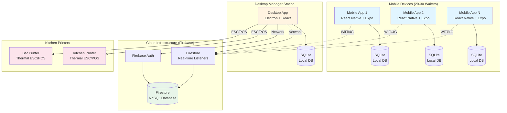
```mermaid
graph TB
    subgraph "Mobile Devices (20-30 Waiters)"
        MA1[Mobile App 1<br/>React Native + Expo]
        MA2[Mobile App 2<br/>React Native + Expo]
        MA3[Mobile App N<br/>React Native + Expo]
        
        MDB1[(SQLite<br/>Local DB)]
        MDB2[(SQLite<br/>Local DB)]
        MDB3[(SQLite<br/>Local DB)]
        
        MA1 --> MDB1
        MA2 --> MDB2
        MA3 --> MDB3
    end
    
    subgraph "Desktop Manager Station"
        DA[Desktop App<br/>Electron + React]
        DDB[(SQLite<br/>Local DB)]
        DA --> DDB
    end
    
    subgraph "Cloud Infrastructure (Firebase)"
        RT[Firestore<br/>Real-time Listeners]
        CDB[(Firestore<br/>NoSQL Database)]
        AUTH[Firebase Auth]
        
        RT --> CDB
        AUTH --> CDB
    end
    
    subgraph "Kitchen Printers"
        KP[Kitchen Printer<br/>Thermal ESC/POS]
        BP[Bar Printer<br/>Thermal ESC/POS]
    end
    
    MA1 -.->|WiFi/4G| RT
    MA2 -.->|WiFi/4G| RT
    MA3 -.->|WiFi/4G| RT
    DA -->|Network| RT
    DA -->|Network| AUTH
    
    DA -->|ESC/POS| KP
    DA -->|ESC/POS| BP
    
    style MA1 fill:#e1f5ff
    style MA2 fill:#e1f5ff
    style MA3 fill:#e1f5ff
    style DA fill:#fff4e1
    style CDB fill:#e8f5e9
    style KP fill:#fce4ec
    style BP fill:#fce4ec
```

---

## Waiter PIN Management

### Waiter PIN Management Workflow

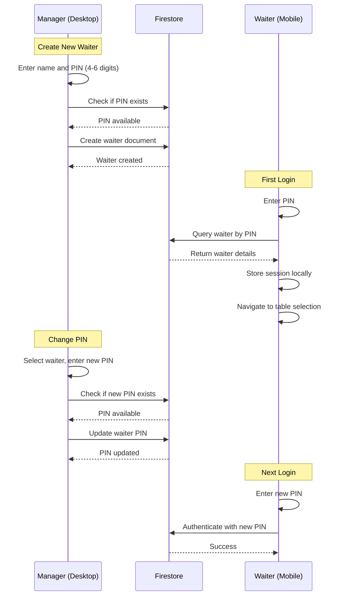
```mermaid
sequenceDiagram
    participant M as Manager (Desktop)
    participant DB as Firestore
    participant W as Waiter (Mobile)
    
    Note over M: Create New Waiter
    M->>M: Enter name and PIN (4-6 digits)
    M->>DB: Check if PIN exists
    DB-->>M: PIN available
    M->>DB: Create waiter document
    DB-->>M: Waiter created
    
    Note over W: First Login
    W->>W: Enter PIN
    W->>DB: Query waiter by PIN
    DB-->>W: Return waiter details
    W->>W: Store session locally
    W->>W: Navigate to table selection
    
    Note over M: Change PIN
    M->>M: Select waiter, enter new PIN
    M->>DB: Check if new PIN exists
    DB-->>M: PIN available
    M->>DB: Update waiter PIN
    DB-->>M: PIN updated
    
    Note over W: Next Login
    W->>W: Enter new PIN
    W->>DB: Authenticate with new PIN
    DB-->>W: Success
```

---

## Manager Authentication Flow

### Manager PIN Authentication for Inventory Operations

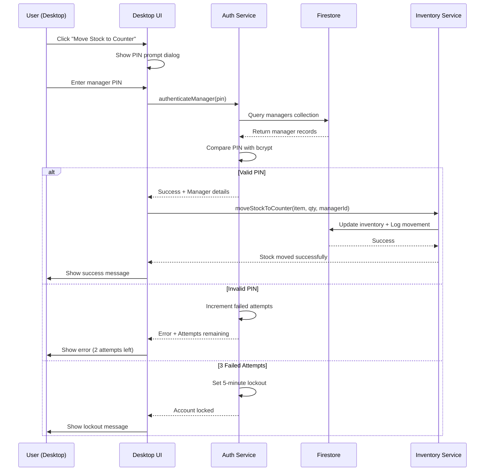
```mermaid
sequenceDiagram
    participant U as User (Desktop)
    participant UI as Desktop UI
    participant Auth as Auth Service
    participant DB as Firestore
    participant Inv as Inventory Service
    
    U->>UI: Click "Move Stock to Counter"
    UI->>UI: Show PIN prompt dialog
    U->>UI: Enter manager PIN
    
    UI->>Auth: authenticateManager(pin)
    Auth->>DB: Query managers collection
    DB-->>Auth: Return manager records
    Auth->>Auth: Compare PIN with bcrypt
    
    alt Valid PIN
        Auth-->>UI: Success + Manager details
        UI->>Inv: moveStockToCounter(item, qty, managerId)
        Inv->>DB: Update inventory + Log movement
        DB-->>Inv: Success
        Inv-->>UI: Stock moved successfully
        UI->>U: Show success message
    else Invalid PIN
        Auth->>Auth: Increment failed attempts
        Auth-->>UI: Error + Attempts remaining
        UI->>U: Show error (2 attempts left)
    else 3 Failed Attempts
        Auth->>Auth: Set 5-minute lockout
        Auth-->>UI: Account locked
        UI->>U: Show lockout message
    end
```

---

## Order Creation and Synchronization

### Order Creation and Sync Flow

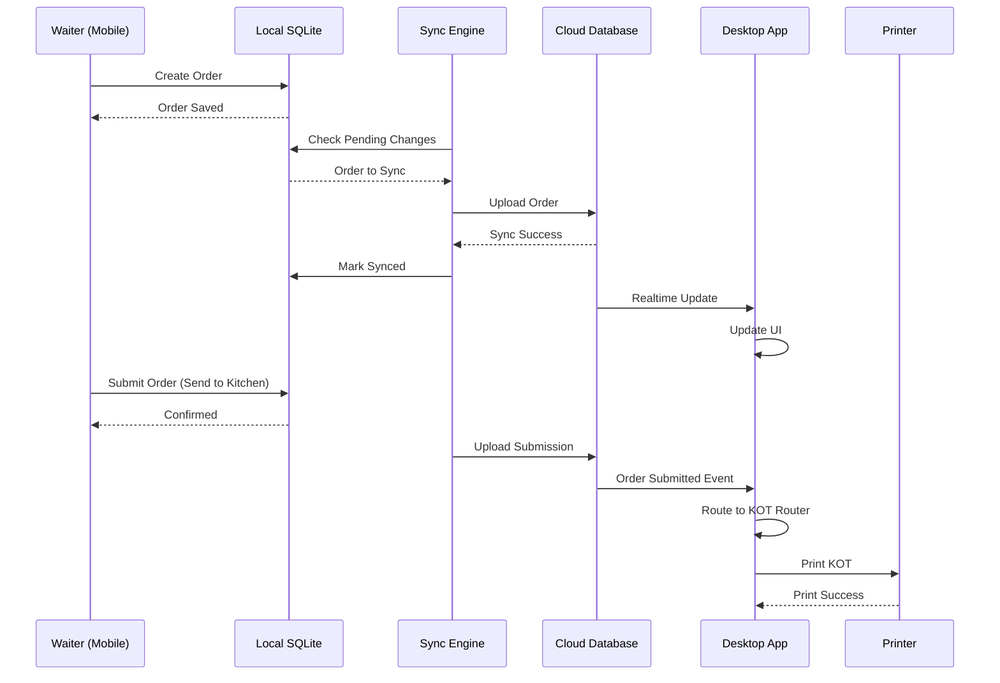
```mermaid
sequenceDiagram
    participant W as Waiter (Mobile)
    participant LS as Local SQLite
    participant SE as Sync Engine
    participant CD as Cloud Database
    participant D as Desktop App
    participant P as Printer

    W->>LS: Create Order
    LS-->>W: Order Saved
    
    SE->>LS: Check Pending Changes
    LS-->>SE: Order to Sync
    
    SE->>CD: Upload Order
    CD-->>SE: Sync Success
    SE->>LS: Mark Synced
    
    CD->>D: Realtime Update
    D->>D: Update UI
    
    W->>LS: Submit Order (Send to Kitchen)
    LS-->>W: Confirmed
    
    SE->>CD: Upload Submission
    CD->>D: Order Submitted Event
    
    D->>D: Route to KOT Router
    D->>P: Print KOT
    P-->>D: Print Success
```

---

## Offline Order Capture

### Offline Order Capture and Sync Flow

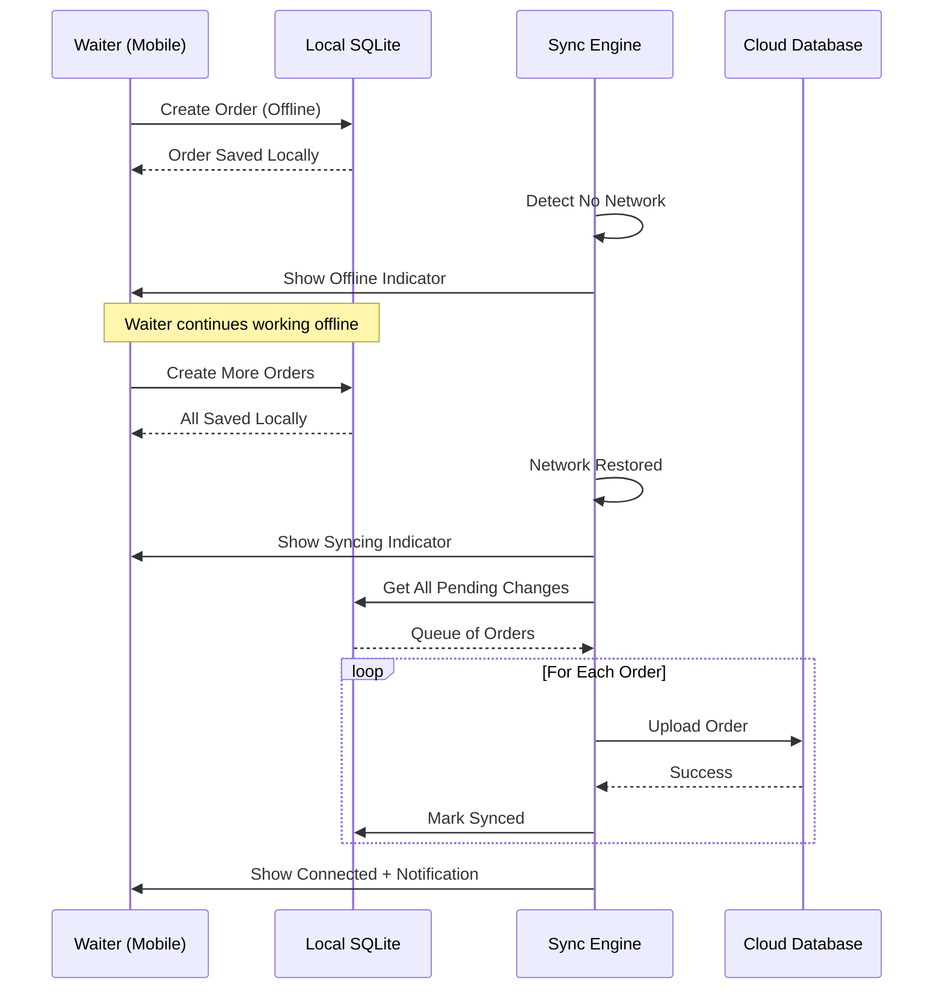
```mermaid
sequenceDiagram
    participant W as Waiter (Mobile)
    participant LS as Local SQLite
    participant SE as Sync Engine
    participant CD as Cloud Database

    W->>LS: Create Order (Offline)
    LS-->>W: Order Saved Locally
    
    SE->>SE: Detect No Network
    SE->>W: Show Offline Indicator
    
    Note over W,LS: Waiter continues working offline
    
    W->>LS: Create More Orders
    LS-->>W: All Saved Locally
    
    SE->>SE: Network Restored
    SE->>W: Show Syncing Indicator
    
    SE->>LS: Get All Pending Changes
    LS-->>SE: Queue of Orders
    
    loop For Each Order
        SE->>CD: Upload Order
        CD-->>SE: Success
        SE->>LS: Mark Synced
    end
    
    SE->>W: Show Connected + Notification
```

---

## KOT Routing Logic

### KOT Routing Decision Flow

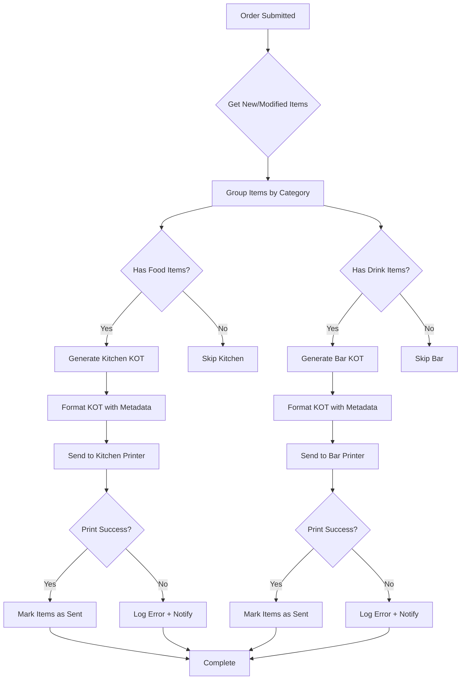
```mermaid
flowchart TD
    A[Order Submitted] --> B{Get New/Modified Items}
    B --> C[Group Items by Category]
    
    C --> D{Has Food Items?}
    C --> E{Has Drink Items?}
    
    D -->|Yes| F[Generate Kitchen KOT]
    D -->|No| G[Skip Kitchen]
    
    E -->|Yes| H[Generate Bar KOT]
    E -->|No| I[Skip Bar]
    
    F --> J[Format KOT with Metadata]
    H --> K[Format KOT with Metadata]
    
    J --> L[Send to Kitchen Printer]
    K --> M[Send to Bar Printer]
    
    L --> N{Print Success?}
    M --> O{Print Success?}
    
    N -->|Yes| P[Mark Items as Sent]
    N -->|No| Q[Log Error + Notify]
    
    O -->|Yes| R[Mark Items as Sent]
    O -->|No| S[Log Error + Notify]
    
    P --> T[Complete]
    R --> T
    Q --> T
    S --> T
```

### KOT Generation Process

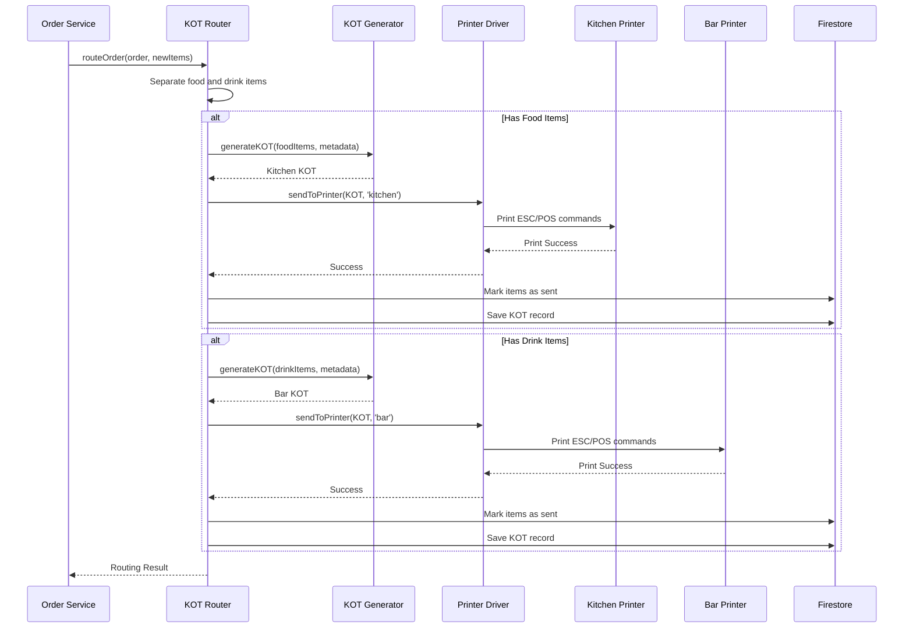
```mermaid
sequenceDiagram
    participant O as Order Service
    participant KR as KOT Router
    participant KG as KOT Generator
    participant PD as Printer Driver
    participant KP as Kitchen Printer
    participant BP as Bar Printer
    participant DB as Firestore

    O->>KR: routeOrder(order, newItems)
    KR->>KR: Separate food and drink items
    
    alt Has Food Items
        KR->>KG: generateKOT(foodItems, metadata)
        KG-->>KR: Kitchen KOT
        KR->>PD: sendToPrinter(KOT, 'kitchen')
        PD->>KP: Print ESC/POS commands
        KP-->>PD: Print Success
        PD-->>KR: Success
        KR->>DB: Mark items as sent
        KR->>DB: Save KOT record
    end
    
    alt Has Drink Items
        KR->>KG: generateKOT(drinkItems, metadata)
        KG-->>KR: Bar KOT
        KR->>PD: sendToPrinter(KOT, 'bar')
        PD->>BP: Print ESC/POS commands
        BP-->>PD: Print Success
        PD-->>KR: Success
        KR->>DB: Mark items as sent
        KR->>DB: Save KOT record
    end
    
    KR-->>O: Routing Result
```

---

## Table Operations

### Table Merge Operation

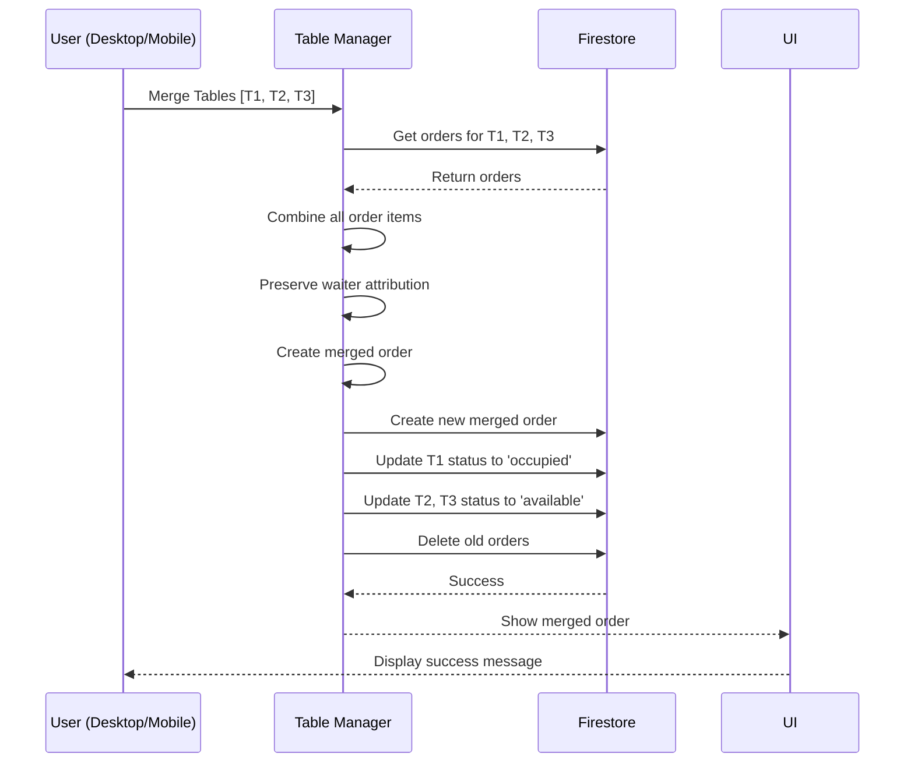
```mermaid
sequenceDiagram
    participant U as User (Desktop/Mobile)
    participant TM as Table Manager
    participant DB as Firestore
    participant UI as UI
    
    U->>TM: Merge Tables [T1, T2, T3]
    TM->>DB: Get orders for T1, T2, T3
    DB-->>TM: Return orders
    
    TM->>TM: Combine all order items
    TM->>TM: Preserve waiter attribution
    TM->>TM: Create merged order
    
    TM->>DB: Create new merged order
    TM->>DB: Update T1 status to 'occupied'
    TM->>DB: Update T2, T3 status to 'available'
    TM->>DB: Delete old orders
    
    DB-->>TM: Success
    TM-->>UI: Show merged order
    UI-->>U: Display success message
```

### Table Split Operation

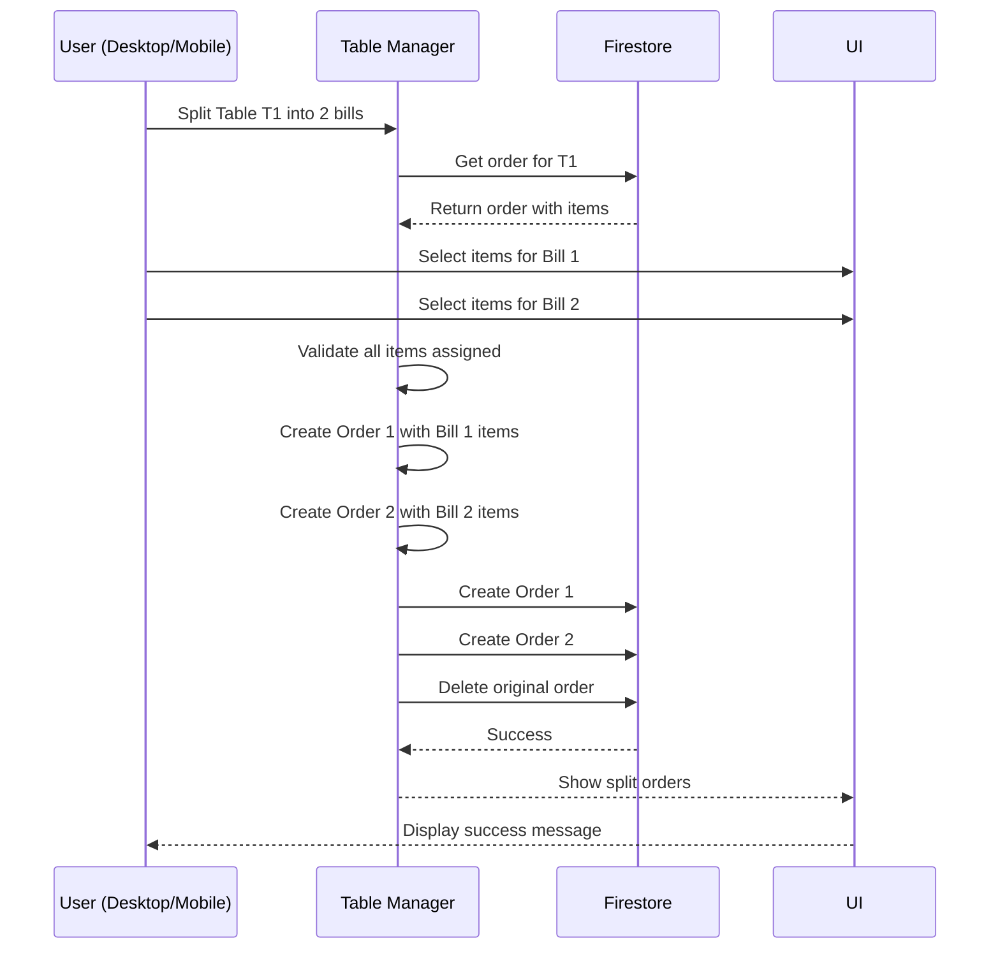
```mermaid
sequenceDiagram
    participant U as User (Desktop/Mobile)
    participant TM as Table Manager
    participant DB as Firestore
    participant UI as UI
    
    U->>TM: Split Table T1 into 2 bills
    TM->>DB: Get order for T1
    DB-->>TM: Return order with items
    
    U->>UI: Select items for Bill 1
    U->>UI: Select items for Bill 2
    
    TM->>TM: Validate all items assigned
    TM->>TM: Create Order 1 with Bill 1 items
    TM->>TM: Create Order 2 with Bill 2 items
    
    TM->>DB: Create Order 1
    TM->>DB: Create Order 2
    TM->>DB: Delete original order
    
    DB-->>TM: Success
    TM-->>UI: Show split orders
    UI-->>U: Display success message
```

### Table Transfer Operation

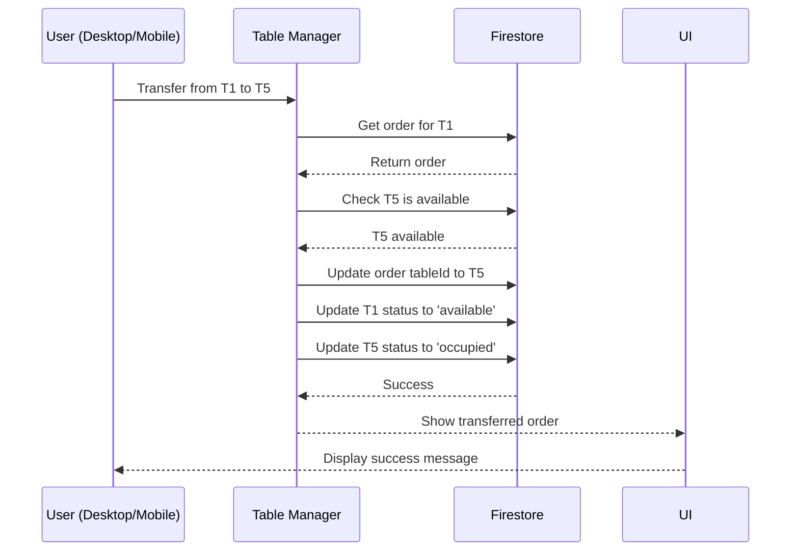
```mermaid
sequenceDiagram
    participant U as User (Desktop/Mobile)
    participant TM as Table Manager
    participant DB as Firestore
    participant UI as UI
    
    U->>TM: Transfer from T1 to T5
    TM->>DB: Get order for T1
    DB-->>TM: Return order
    
    TM->>DB: Check T5 is available
    DB-->>TM: T5 available
    
    TM->>DB: Update order tableId to T5
    TM->>DB: Update T1 status to 'available'
    TM->>DB: Update T5 status to 'occupied'
    
    DB-->>TM: Success
    TM-->>UI: Show transferred order
    UI-->>U: Display success message
```

---

## Inventory Management

### Inventory Movement with Manager Authentication

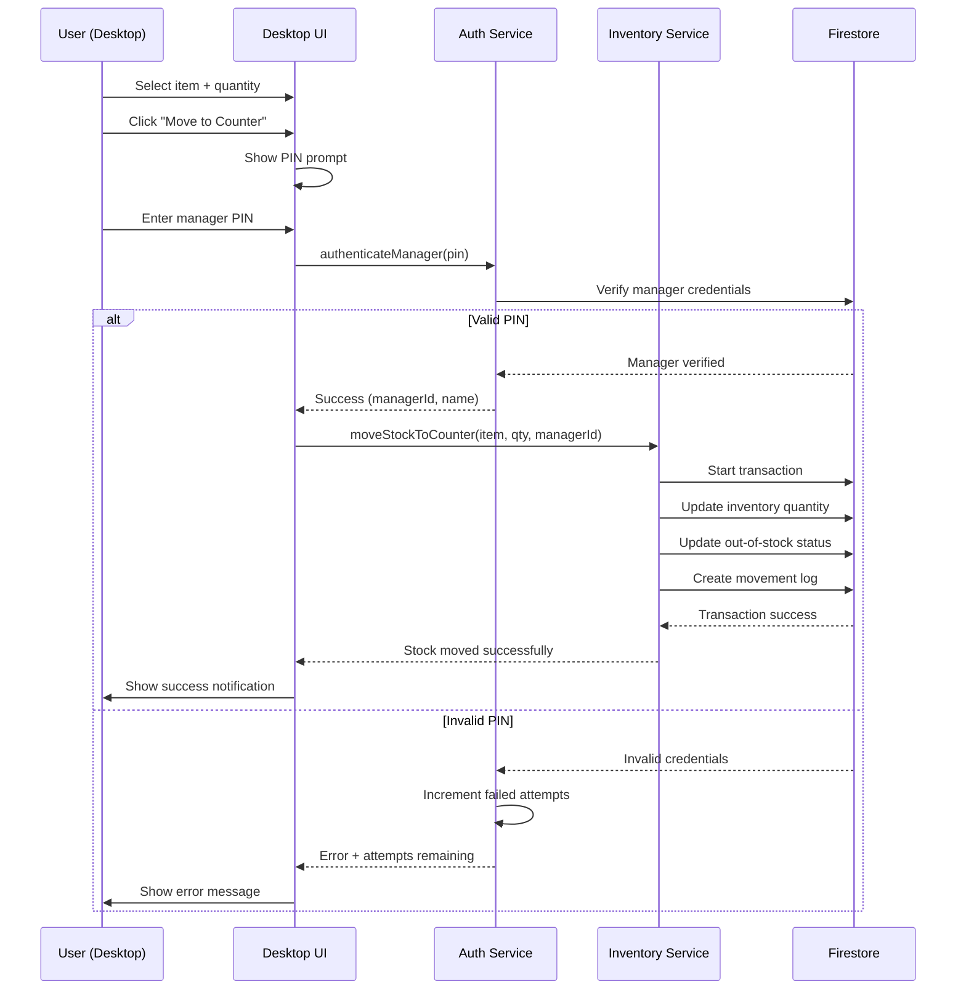
```mermaid
sequenceDiagram
    participant U as User (Desktop)
    participant UI as Desktop UI
    participant Auth as Auth Service
    participant Inv as Inventory Service
    participant DB as Firestore
    
    U->>UI: Select item + quantity
    U->>UI: Click "Move to Counter"
    
    UI->>UI: Show PIN prompt
    U->>UI: Enter manager PIN
    
    UI->>Auth: authenticateManager(pin)
    Auth->>DB: Verify manager credentials
    
    alt Valid PIN
        DB-->>Auth: Manager verified
        Auth-->>UI: Success (managerId, name)
        
        UI->>Inv: moveStockToCounter(item, qty, managerId)
        
        Inv->>DB: Start transaction
        Inv->>DB: Update inventory quantity
        Inv->>DB: Update out-of-stock status
        Inv->>DB: Create movement log
        DB-->>Inv: Transaction success
        
        Inv-->>UI: Stock moved successfully
        UI->>U: Show success notification
        
    else Invalid PIN
        DB-->>Auth: Invalid credentials
        Auth->>Auth: Increment failed attempts
        Auth-->>UI: Error + attempts remaining
        UI->>U: Show error message
    end
```

### Auto Out-of-Stock for Bar Items

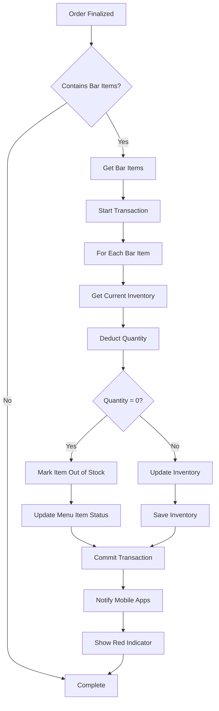
```mermaid
flowchart TD
    A[Order Finalized] --> B{Contains Bar Items?}
    B -->|No| C[Complete]
    B -->|Yes| D[Get Bar Items]
    
    D --> E[Start Transaction]
    E --> F[For Each Bar Item]
    
    F --> G[Get Current Inventory]
    G --> H[Deduct Quantity]
    H --> I{Quantity = 0?}
    
    I -->|Yes| J[Mark Item Out of Stock]
    I -->|No| K[Update Inventory]
    
    J --> L[Update Menu Item Status]
    K --> M[Save Inventory]
    
    L --> N[Commit Transaction]
    M --> N
    
    N --> O[Notify Mobile Apps]
    O --> P[Show Red Indicator]
    P --> C
```

### Inventory Restocking Flow

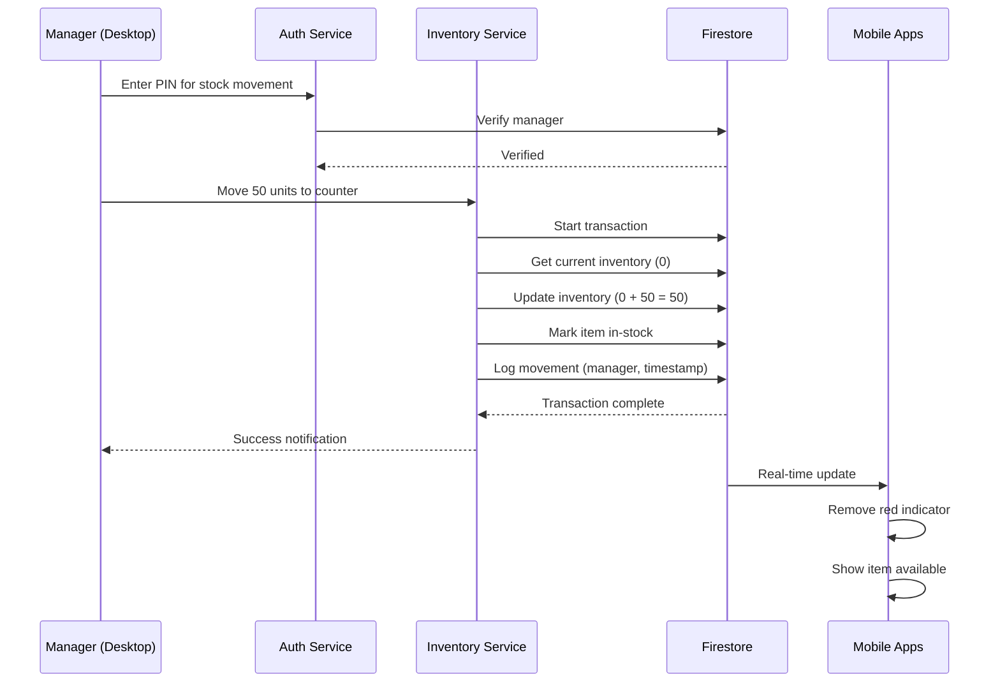
```mermaid
sequenceDiagram
    participant M as Manager (Desktop)
    participant Auth as Auth Service
    participant Inv as Inventory Service
    participant DB as Firestore
    participant Mobile as Mobile Apps
    
    M->>Auth: Enter PIN for stock movement
    Auth->>DB: Verify manager
    DB-->>Auth: Verified
    
    M->>Inv: Move 50 units to counter
    Inv->>DB: Start transaction
    
    Inv->>DB: Get current inventory (0)
    Inv->>DB: Update inventory (0 + 50 = 50)
    Inv->>DB: Mark item in-stock
    Inv->>DB: Log movement (manager, timestamp)
    
    DB-->>Inv: Transaction complete
    Inv-->>M: Success notification
    
    DB->>Mobile: Real-time update
    Mobile->>Mobile: Remove red indicator
    Mobile->>Mobile: Show item available
```

---

## Billing Flow

### Bill Generation and Payment

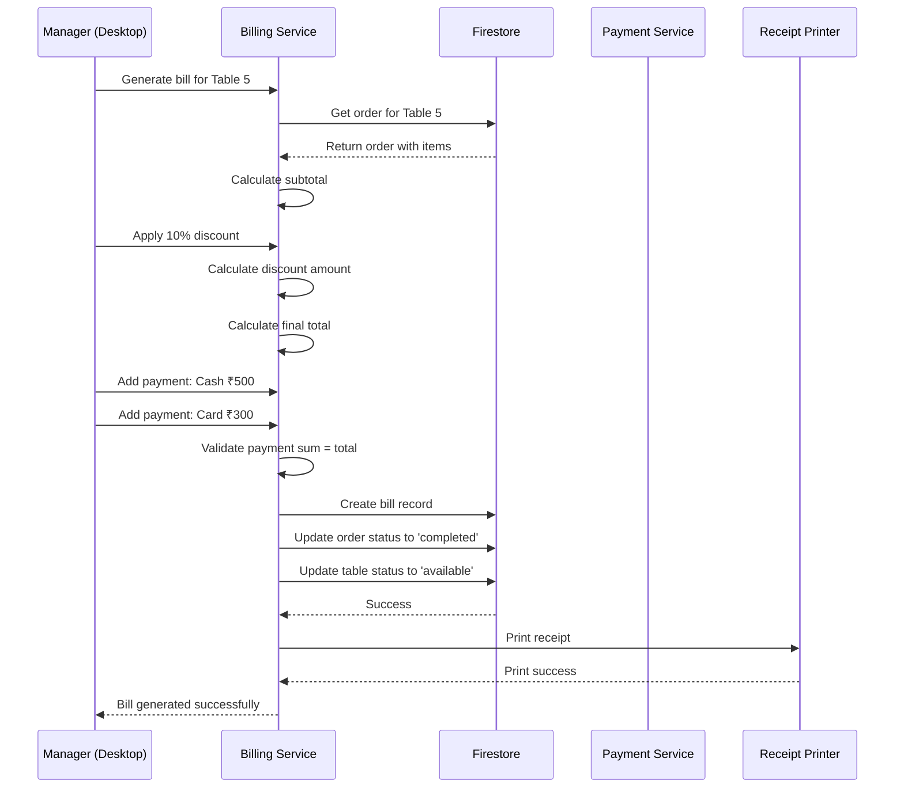
```mermaid
sequenceDiagram
    participant M as Manager (Desktop)
    participant BS as Billing Service
    participant DB as Firestore
    participant PS as Payment Service
    participant Printer as Receipt Printer
    
    M->>BS: Generate bill for Table 5
    BS->>DB: Get order for Table 5
    DB-->>BS: Return order with items
    
    BS->>BS: Calculate subtotal
    M->>BS: Apply 10% discount
    BS->>BS: Calculate discount amount
    BS->>BS: Calculate final total
    
    M->>BS: Add payment: Cash ₹500
    M->>BS: Add payment: Card ₹300
    BS->>BS: Validate payment sum = total
    
    BS->>DB: Create bill record
    BS->>DB: Update order status to 'completed'
    BS->>DB: Update table status to 'available'
    
    DB-->>BS: Success
    
    BS->>Printer: Print receipt
    Printer-->>BS: Print success
    
    BS-->>M: Bill generated successfully
```

### Pending Bill Creation

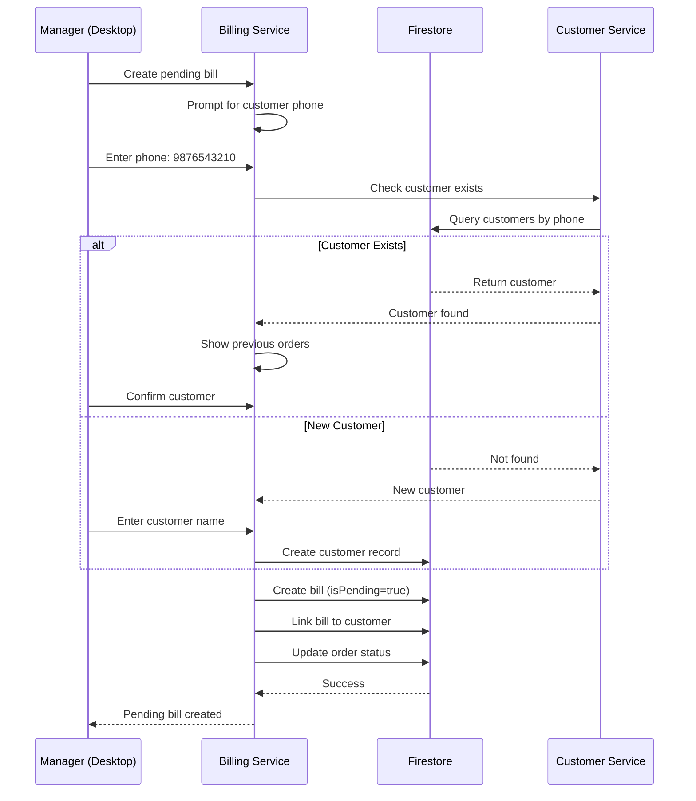
```mermaid
sequenceDiagram
    participant M as Manager (Desktop)
    participant BS as Billing Service
    participant DB as Firestore
    participant CS as Customer Service
    
    M->>BS: Create pending bill
    BS->>BS: Prompt for customer phone
    M->>BS: Enter phone: 9876543210
    
    BS->>CS: Check customer exists
    CS->>DB: Query customers by phone
    
    alt Customer Exists
        DB-->>CS: Return customer
        CS-->>BS: Customer found
        BS->>BS: Show previous orders
        M->>BS: Confirm customer
    else New Customer
        DB-->>CS: Not found
        CS-->>BS: New customer
        M->>BS: Enter customer name
        BS->>DB: Create customer record
    end
    
    BS->>DB: Create bill (isPending=true)
    BS->>DB: Link bill to customer
    BS->>DB: Update order status
    
    DB-->>BS: Success
    BS-->>M: Pending bill created
```

### Split Payment Validation

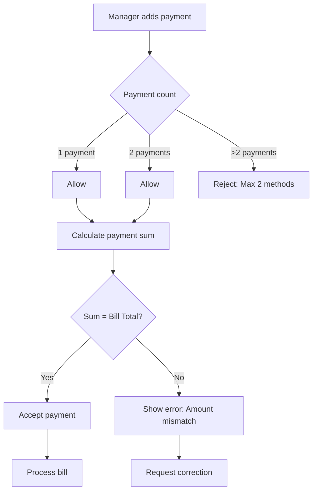
```mermaid
flowchart TD
    A[Manager adds payment] --> B{Payment count}
    B -->|1 payment| C[Allow]
    B -->|2 payments| D[Allow]
    B -->|>2 payments| E[Reject: Max 2 methods]
    
    C --> F[Calculate payment sum]
    D --> F
    
    F --> G{Sum = Bill Total?}
    G -->|Yes| H[Accept payment]
    G -->|No| I[Show error: Amount mismatch]
    
    H --> J[Process bill]
    I --> K[Request correction]
```

---

## Data Model Relationships

### Firestore Collections Entity Relationship

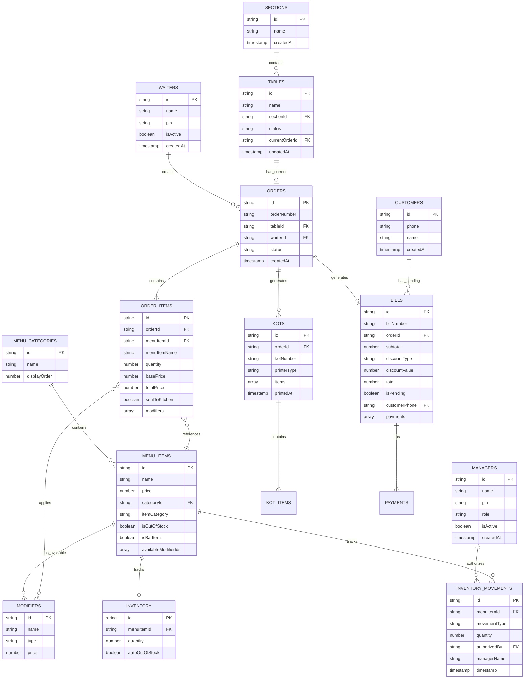
```mermaid
erDiagram
    MANAGERS ||--o{ INVENTORY_MOVEMENTS : authorizes
    WAITERS ||--o{ ORDERS : creates
    SECTIONS ||--o{ TABLES : contains
    TABLES ||--o| ORDERS : has_current
    MENU_CATEGORIES ||--o{ MENU_ITEMS : contains
    MENU_ITEMS ||--o{ MODIFIERS : has_available
    MENU_ITEMS ||--o| INVENTORY : tracks
    ORDERS ||--|{ ORDER_ITEMS : contains
    ORDER_ITEMS }o--|| MENU_ITEMS : references
    ORDER_ITEMS }o--o{ MODIFIERS : applies
    ORDERS ||--o{ KOTS : generates
    KOTS ||--|{ KOT_ITEMS : contains
    ORDERS ||--o| BILLS : generates
    BILLS ||--|{ PAYMENTS : has
    CUSTOMERS ||--o{ BILLS : has_pending
    MENU_ITEMS ||--o{ INVENTORY_MOVEMENTS : tracks
    
    MANAGERS {
        string id PK
        string name
        string pin
        string role
        boolean isActive
        timestamp createdAt
    }
    
    WAITERS {
        string id PK
        string name
        string pin
        boolean isActive
        timestamp createdAt
    }
    
    SECTIONS {
        string id PK
        string name
        timestamp createdAt
    }
    
    TABLES {
        string id PK
        string name
        string sectionId FK
        string status
        string currentOrderId FK
        timestamp updatedAt
    }
    
    MENU_CATEGORIES {
        string id PK
        string name
        number displayOrder
    }
    
    MENU_ITEMS {
        string id PK
        string name
        number price
        string categoryId FK
        string itemCategory
        boolean isOutOfStock
        boolean isBarItem
        array availableModifierIds
    }
    
    MODIFIERS {
        string id PK
        string name
        string type
        number price
    }
    
    INVENTORY {
        string id PK
        string menuItemId FK
        number quantity
        boolean autoOutOfStock
    }
    
    INVENTORY_MOVEMENTS {
        string id PK
        string menuItemId FK
        string movementType
        number quantity
        string authorizedBy FK
        string managerName
        timestamp timestamp
    }
    
    ORDERS {
        string id PK
        string orderNumber
        string tableId FK
        string waiterId FK
        string status
        timestamp createdAt
    }
    
    ORDER_ITEMS {
        string id PK
        string orderId FK
        string menuItemId FK
        string menuItemName
        number quantity
        number basePrice
        number totalPrice
        boolean sentToKitchen
        array modifiers
    }
    
    KOTS {
        string id PK
        string orderId FK
        string kotNumber
        string printerType
        array items
        timestamp printedAt
    }
    
    BILLS {
        string id PK
        string billNumber
        string orderId FK
        number subtotal
        string discountType
        number discountValue
        number total
        boolean isPending
        string customerPhone FK
        array payments
    }
    
    CUSTOMERS {
        string id PK
        string phone
        string name
        timestamp createdAt
    }
```

---

## Mobile App User Flow

### Desktop Order Entry Flow

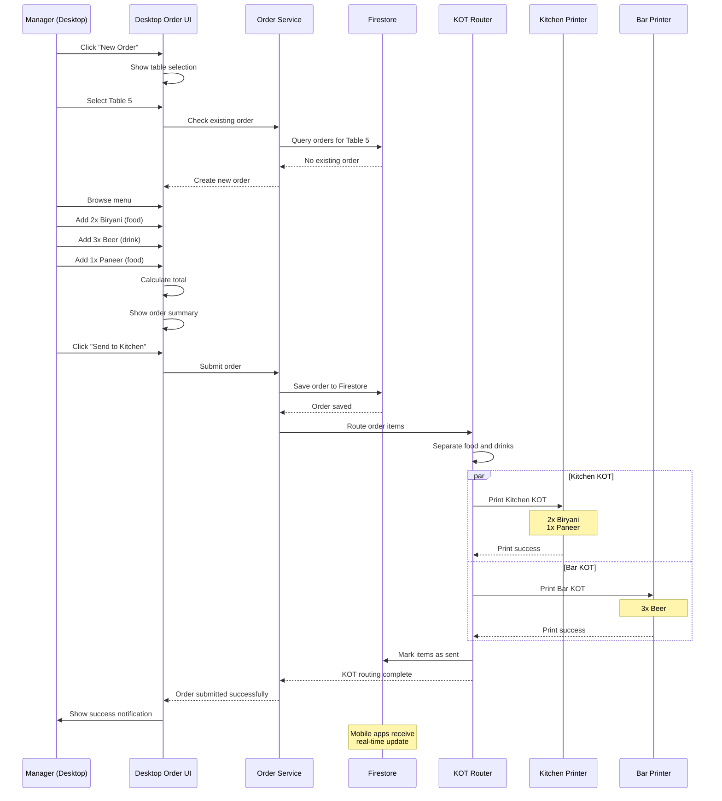
```mermaid
sequenceDiagram
    participant M as Manager (Desktop)
    participant UI as Desktop Order UI
    participant OS as Order Service
    participant DB as Firestore
    participant KR as KOT Router
    participant KP as Kitchen Printer
    participant BP as Bar Printer
    
    M->>UI: Click "New Order"
    UI->>UI: Show table selection
    M->>UI: Select Table 5
    
    UI->>OS: Check existing order
    OS->>DB: Query orders for Table 5
    DB-->>OS: No existing order
    OS-->>UI: Create new order
    
    M->>UI: Browse menu
    M->>UI: Add 2x Biryani (food)
    M->>UI: Add 3x Beer (drink)
    M->>UI: Add 1x Paneer (food)
    
    UI->>UI: Calculate total
    UI->>UI: Show order summary
    
    M->>UI: Click "Send to Kitchen"
    
    UI->>OS: Submit order
    OS->>DB: Save order to Firestore
    DB-->>OS: Order saved
    
    OS->>KR: Route order items
    KR->>KR: Separate food and drinks
    
    par Kitchen KOT
        KR->>KP: Print Kitchen KOT
        Note over KP: 2x Biryani<br/>1x Paneer
        KP-->>KR: Print success
    and Bar KOT
        KR->>BP: Print Bar KOT
        Note over BP: 3x Beer
        BP-->>KR: Print success
    end
    
    KR->>DB: Mark items as sent
    KR-->>OS: KOT routing complete
    OS-->>UI: Order submitted successfully
    UI->>M: Show success notification
    
    Note over DB: Mobile apps receive<br/>real-time update
```

### Waiter Mobile App Navigation Flow

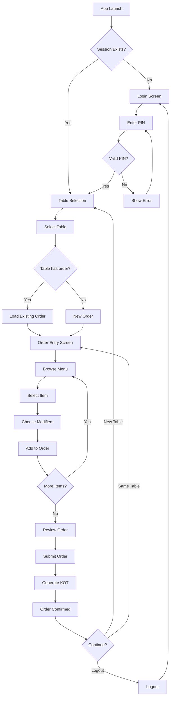
```mermaid
flowchart TD
    A[App Launch] --> B{Session Exists?}
    B -->|No| C[Login Screen]
    B -->|Yes| D[Table Selection]
    
    C --> E[Enter PIN]
    E --> F{Valid PIN?}
    F -->|No| G[Show Error]
    F -->|Yes| D
    G --> E
    
    D --> H[Select Table]
    H --> I{Table has order?}
    I -->|Yes| J[Load Existing Order]
    I -->|No| K[New Order]
    
    J --> L[Order Entry Screen]
    K --> L
    
    L --> M[Browse Menu]
    M --> N[Select Item]
    N --> O[Choose Modifiers]
    O --> P[Add to Order]
    P --> Q{More Items?}
    
    Q -->|Yes| M
    Q -->|No| R[Review Order]
    
    R --> S[Submit Order]
    S --> T[Generate KOT]
    T --> U[Order Confirmed]
    
    U --> V{Continue?}
    V -->|New Table| D
    V -->|Same Table| L
    V -->|Logout| W[Logout]
    W --> C
```

### Desktop App Manager Flow

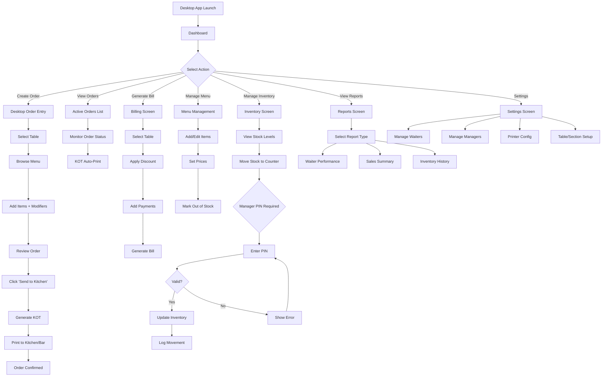
```mermaid
flowchart TD
    A[Desktop App Launch] --> B[Dashboard]
    
    B --> C{Select Action}
    
    C -->|Create Order| CO[Desktop Order Entry]
    C -->|View Orders| D[Active Orders List]
    C -->|Generate Bill| E[Billing Screen]
    C -->|Manage Menu| F[Menu Management]
    C -->|Manage Inventory| G[Inventory Screen]
    C -->|View Reports| H[Reports Screen]
    C -->|Settings| I[Settings Screen]
    
    CO --> CO1[Select Table]
    CO1 --> CO2[Browse Menu]
    CO2 --> CO3[Add Items + Modifiers]
    CO3 --> CO4[Review Order]
    CO4 --> CO5[Click 'Send to Kitchen']
    CO5 --> CO6[Generate KOT]
    CO6 --> CO7[Print to Kitchen/Bar]
    CO7 --> CO8[Order Confirmed]
    
    D --> J[Monitor Order Status]
    J --> K[KOT Auto-Print]
    
    E --> L[Select Table]
    L --> M[Apply Discount]
    M --> N[Add Payments]
    N --> O[Generate Bill]
    
    F --> P[Add/Edit Items]
    P --> Q[Set Prices]
    Q --> R[Mark Out of Stock]
    
    G --> S[View Stock Levels]
    S --> T[Move Stock to Counter]
    T --> U{Manager PIN Required}
    U --> V[Enter PIN]
    V --> W{Valid?}
    W -->|Yes| X[Update Inventory]
    W -->|No| Y[Show Error]
    Y --> V
    X --> Z[Log Movement]
    
    H --> AA[Select Report Type]
    AA --> AB[Waiter Performance]
    AA --> AC[Sales Summary]
    AA --> AD[Inventory History]
    
    I --> AE[Manage Waiters]
    I --> AF[Manage Managers]
    I --> AG[Printer Config]
    I --> AH[Table/Section Setup]
```

---

## Component Architecture

### Mobile App Component Structure

```mermaid
graph TB
    subgraph "Mobile App (React Native)"
        APP[App.tsx]
        
        subgraph "Screens"
            AUTH[AuthenticationScreen]
            TABLE[TableSelectionScreen]
            ORDER[OrderEntryScreen]
            MENU[MenuBrowserScreen]
        end
        
        subgraph "Components"
            SYNC[SyncStatusIndicator]
            ITEM[OrderItemCard]
            MOD[ModifierSelector]
            SEARCH[MenuSearchBar]
        end
        
        subgraph "Services"
            SYNCENG[FirestoreSyncEngine]
            AUTHSVC[AuthService]
            ORDERSVC[OrderService]
            NETSVC[NetworkMonitor]
        end
        
        subgraph "Storage"
            SQLITE[(SQLite Local DB)]
            ASYNC[AsyncStorage]
        end
        
        APP --> AUTH
        APP --> TABLE
        APP --> ORDER
        APP --> MENU
        
        AUTH --> AUTHSVC
        TABLE --> ORDERSVC
        ORDER --> ORDERSVC
        MENU --> ORDERSVC
        
        ORDER --> SYNC
        ORDER --> ITEM
        ORDER --> MOD
        MENU --> SEARCH
        
        SYNCENG --> SQLITE
        SYNCENG --> ASYNC
        AUTHSVC --> ASYNC
        ORDERSVC --> SQLITE
        ORDERSVC --> SYNCENG
        
        NETSVC --> SYNCENG
    end
    
    subgraph "Firebase"
        FIRESTORE[(Firestore)]
        FBAUTH[Firebase Auth]
    end
    
    SYNCENG -.->|Real-time| FIRESTORE
    AUTHSVC -.->|Auth| FBAUTH
```

### Desktop App Component Structure

```mermaid
graph TB
    subgraph "Desktop App (Electron + React)"
        MAIN[main.js - Electron Main]
        
        subgraph "React Components"
            DASH[Dashboard]
            DORDER[DesktopOrderEntryScreen]
            BILL[BillingScreen]
            MENUUI[MenuManagementScreen]
            INVUI[InventoryManagementScreen]
            TABLEUI[TableManagementScreen]
            REPORT[ReportingScreen]
            SETTINGS[SettingsScreen]
        end
        
        subgraph "Services"
            ORDERSVC[OrderService]
            KOTR[KOTRouter]
            PRINTER[PrinterDriver]
            BILLSVC[BillingService]
            INVSVC[InventoryService]
            MGRSVC[ManagerAuthService]
            REPORTSVC[ReportService]
        end
        
        subgraph "Storage"
            SQLITED[(SQLite Local DB)]
            CONFIG[Config Files]
        end
        
        MAIN --> DASH
        DASH --> DORDER
        DASH --> BILL
        DASH --> MENUUI
        DASH --> INVUI
        DASH --> TABLEUI
        DASH --> REPORT
        DASH --> SETTINGS
        
        DORDER --> ORDERSVC
        DORDER --> KOTR
        BILL --> BILLSVC
        MENUUI --> INVSVC
        INVUI --> INVSVC
        INVUI --> MGRSVC
        TABLEUI --> ORDERSVC
        REPORT --> REPORTSVC
        
        ORDERSVC --> KOTR
        BILLSVC --> KOTR
        KOTR --> PRINTER
        
        ORDERSVC --> SQLITED
        BILLSVC --> SQLITED
        INVSVC --> SQLITED
        REPORTSVC --> SQLITED
        
        PRINTER --> CONFIG
    end
    
    subgraph "Firebase"
        FIRESTORED[(Firestore)]
        FBADMIN[Firebase Admin SDK]
    end
    
    subgraph "Hardware"
        KP[Kitchen Printer]
        BP[Bar Printer]
    end
    
    ORDERSVC -.->|Admin SDK| FBADMIN
    BILLSVC -.->|Admin SDK| FBADMIN
    INVSVC -.->|Admin SDK| FBADMIN
    ORDERSVC -.->|Real-time| FIRESTORED
    
    PRINTER -->|ESC/POS| KP
    PRINTER -->|ESC/POS| BP
```

---

## State Management

### Order State Machine

```mermaid
stateDiagram-v2
    [*] --> Draft: Create Order
    
    Draft --> Draft: Add Items
    Draft --> Draft: Modify Items
    Draft --> Draft: Remove Items
    Draft --> Submitted: Submit to Kitchen
    Draft --> Cancelled: Cancel Order
    
    Submitted --> Submitted: Add More Items (New KOT)
    Submitted --> Completed: Generate Bill
    Submitted --> Cancelled: Void Order (Manager Only)
    
    Completed --> [*]
    Cancelled --> [*]
    
    note right of Draft
        Items can be freely modified
        No KOT printed yet
    end note
    
    note right of Submitted
        Items sent to kitchen
        Cannot modify sent items
        Can only add new items
    end note
    
    note right of Completed
        Bill generated
        Payment processed
        Table freed
    end note
```

### Table State Machine

```mermaid
stateDiagram-v2
    [*] --> Available: Table Created
    
    Available --> Occupied: Order Created
    Available --> Available: No Action
    
    Occupied --> Occupied: Order Modified
    Occupied --> PendingBill: Bill Generated (Unpaid)
    Occupied --> Available: Bill Paid
    
    PendingBill --> PendingBill: Waiting for Payment
    PendingBill --> Available: Payment Received
    
    Available --> [*]: Table Deleted
    
    note right of Available
        No active order
        Ready for customers
    end note
    
    note right of Occupied
        Active order exists
        Waiter can modify
    end note
    
    note right of PendingBill
        Bill created but unpaid
        Customer phone recorded
    end note
```

### Sync State Machine

```mermaid
stateDiagram-v2
    [*] --> Initializing: App Launch
    
    Initializing --> Connected: Network Available
    Initializing --> Offline: No Network
    
    Connected --> Syncing: Pending Changes Detected
    Connected --> Connected: No Changes
    Connected --> Offline: Network Lost
    
    Syncing --> Connected: Sync Complete
    Syncing --> Offline: Network Lost During Sync
    Syncing --> Error: Sync Failed
    
    Offline --> Offline: Queue Changes Locally
    Offline --> Syncing: Network Restored
    
    Error --> Syncing: Retry
    Error --> Offline: Give Up
    
    note right of Connected
        Real-time updates active
        Changes sync immediately
    end note
    
    note right of Offline
        Local-only mode
        Changes queued
        Show offline indicator
    end note
    
    note right of Syncing
        Uploading queued changes
        Show progress indicator
    end note
```

---

## Security and Authentication

### Authentication Architecture

```mermaid
graph TB
    subgraph "Mobile App"
        MLOGIN[Login Screen]
        MAUTH[Auth Service]
        MSTORAGE[AsyncStorage]
    end
    
    subgraph "Desktop App"
        DLOGIN[Manager Login]
        DAUTH[Manager Auth Service]
        DSTORAGE[LocalStorage]
        PINPROMPT[PIN Prompt Dialog]
    end
    
    subgraph "Firebase"
        FBAUTH[Firebase Auth]
        WAITERCOL[(Waiters Collection)]
        MGRCOL[(Managers Collection)]
    end
    
    MLOGIN --> MAUTH
    MAUTH --> FBAUTH
    MAUTH --> WAITERCOL
    MAUTH --> MSTORAGE
    
    DLOGIN --> DAUTH
    PINPROMPT --> DAUTH
    DAUTH --> MGRCOL
    DAUTH --> DSTORAGE
    
    WAITERCOL -.->|Plain Text PIN| MAUTH
    MGRCOL -.->|Bcrypt Hashed PIN| DAUTH
```

### Security Layers

```mermaid
flowchart TD
    A[User Action] --> B{Authentication Layer}
    
    B -->|Mobile| C[Waiter PIN Check]
    B -->|Desktop| D[Manager PIN Check]
    
    C --> E{Valid Waiter?}
    D --> F{Valid Manager?}
    
    E -->|Yes| G[Authorization Layer]
    E -->|No| H[Deny Access]
    
    F -->|Yes| I{Check Role}
    F -->|No| J[Increment Failed Attempts]
    
    J --> K{3 Attempts?}
    K -->|Yes| L[5 Min Lockout]
    K -->|No| H
    
    I -->|Owner| M[Full Access]
    I -->|Manager| N[Limited Access]
    I -->|Supervisor| O[Basic Access]
    
    G --> P{Action Type}
    
    P -->|Read| Q[Firestore Security Rules]
    P -->|Write| R[Firestore Security Rules]
    
    Q --> S{Rules Pass?}
    R --> S
    
    S -->|Yes| T[Execute Action]
    S -->|No| U[Deny + Log]
    
    M --> T
    N --> T
    O --> T
    
    T --> V[Audit Log]
    V --> W[Complete]
```

### Firestore Security Rules Flow

```mermaid
flowchart TD
    A[Client Request] --> B{Authenticated?}
    
    B -->|No| C[Deny]
    B -->|Yes| D{Collection Type}
    
    D -->|waiters| E{Read Only?}
    D -->|managers| F{Read Only?}
    D -->|orders| G{Waiter Owns?}
    D -->|menuItems| H{Read Only?}
    D -->|inventory| I{Read Only?}
    
    E -->|Yes| J[Allow]
    E -->|No| K[Deny - Admin SDK Only]
    
    F -->|Yes| J
    F -->|No| K
    
    G -->|Yes| J
    G -->|No| L{All Waiters Can Read?}
    L -->|Yes| J
    L -->|No| C
    
    H -->|Yes| J
    H -->|No| K
    
    I -->|Yes| J
    I -->|No| K
    
    J --> M[Execute Request]
    K --> N[Log Denial]
    C --> N
```

---

## Error Handling and Recovery

### Network Error Recovery Flow

```mermaid
flowchart TD
    A[Network Error Detected] --> B{Error Type}
    
    B -->|Connection Lost| C[Switch to Offline Mode]
    B -->|Timeout| D[Retry with Backoff]
    B -->|Server Error| E[Log Error]
    
    C --> F[Queue Changes Locally]
    F --> G[Show Offline Indicator]
    G --> H[Monitor Network]
    
    H --> I{Network Restored?}
    I -->|No| H
    I -->|Yes| J[Start Sync]
    
    D --> K{Retry Count}
    K -->|< 5| L[Wait Exponentially]
    K -->|>= 5| M[Give Up]
    
    L --> N[Retry Request]
    N --> O{Success?}
    O -->|Yes| P[Complete]
    O -->|No| D
    
    M --> C
    E --> Q[Notify User]
    
    J --> R[Upload Queued Changes]
    R --> S{All Synced?}
    S -->|Yes| T[Show Connected]
    S -->|No| U[Show Partial Sync]
```

### Printer Error Handling

```mermaid
sequenceDiagram
    participant KR as KOT Router
    participant PD as Printer Driver
    participant P as Printer
    participant DB as Firestore
    participant UI as Desktop UI
    
    KR->>PD: Print KOT
    PD->>P: Send ESC/POS commands
    
    alt Printer Online
        P-->>PD: Success
        PD-->>KR: Print Success
        KR->>DB: Mark items as sent
        KR->>DB: Save KOT record
    else Printer Offline
        P--xPD: Connection Failed
        PD-->>KR: Print Failed
        KR->>DB: Save to failed_kots
        KR->>UI: Show error notification
        UI->>UI: Display retry button
    else Printer Out of Paper
        P--xPD: Out of Paper
        PD-->>KR: Print Failed
        KR->>UI: Show "Out of Paper" alert
        UI->>UI: Wait for user action
    end
    
    Note over UI: User clicks Retry
    UI->>KR: Retry failed KOT
    KR->>PD: Print KOT again
    PD->>P: Send ESC/POS commands
    P-->>PD: Success
    PD-->>KR: Print Success
    KR->>DB: Remove from failed_kots
    KR->>DB: Mark items as sent
```

### Database Recovery Flow

```mermaid
flowchart TD
    A[Database Error Detected] --> B{Error Type}
    
    B -->|Corruption| C[Run Integrity Check]
    B -->|Full Storage| D[Show Storage Warning]
    B -->|Lock Timeout| E[Retry Transaction]
    
    C --> F{Integrity OK?}
    F -->|Yes| G[Vacuum Database]
    F -->|No| H[Backup Current DB]
    
    H --> I[Restore from Firestore]
    I --> J[Download All Data]
    J --> K[Rebuild Local DB]
    K --> L[Verify Integrity]
    L --> M{Success?}
    M -->|Yes| N[Resume Operations]
    M -->|No| O[Show Critical Error]
    
    D --> P[Prevent New Orders]
    P --> Q[Suggest Sync & Clear]
    Q --> R[User Confirms]
    R --> S[Sync Pending]
    S --> T[Clear Old Data]
    T --> N
    
    E --> U{Retry Count}
    U -->|< 3| V[Wait & Retry]
    U -->|>= 3| W[Fail Transaction]
    
    V --> X{Success?}
    X -->|Yes| N
    X -->|No| E
    
    G --> N
    W --> O
```

---

## Deployment Architecture

### System Deployment Diagram

```mermaid
graph TB
    subgraph "Restaurant Network"
        subgraph "WiFi Network"
            M1[Mobile Device 1]
            M2[Mobile Device 2]
            M3[Mobile Device 3]
            MN[Mobile Device N]
        end
        
        subgraph "Manager Station"
            DESKTOP[Desktop Computer<br/>Electron App]
            KP[Kitchen Printer<br/>192.168.1.100]
            BP[Bar Printer<br/>192.168.1.101]
        end
        
        ROUTER[WiFi Router<br/>192.168.1.1]
        
        M1 -.->|WiFi| ROUTER
        M2 -.->|WiFi| ROUTER
        M3 -.->|WiFi| ROUTER
        MN -.->|WiFi| ROUTER
        
        DESKTOP -->|Ethernet| ROUTER
        DESKTOP -->|Network| KP
        DESKTOP -->|Network| BP
    end
    
    subgraph "Internet"
        ISP[Internet Service Provider]
    end
    
    subgraph "Firebase Cloud (Google)"
        FIRESTORE[(Firestore Database)]
        FBAUTH[Firebase Authentication]
        FBFUNC[Cloud Functions]
        
        FIRESTORE --> FBFUNC
        FBAUTH --> FIRESTORE
    end
    
    ROUTER -->|Internet| ISP
    ISP -->|HTTPS| FIRESTORE
    ISP -->|HTTPS| FBAUTH
    
    M1 -.->|4G Backup| ISP
    M2 -.->|4G Backup| ISP
    M3 -.->|4G Backup| ISP
    
    style M1 fill:#e1f5ff
    style M2 fill:#e1f5ff
    style M3 fill:#e1f5ff
    style MN fill:#e1f5ff
    style DESKTOP fill:#fff4e1
    style FIRESTORE fill:#e8f5e9
    style KP fill:#fce4ec
    style BP fill:#fce4ec
```

### Mobile App Deployment

```mermaid
flowchart TD
    A[Development] --> B[Build APK]
    B --> C[Sign APK]
    C --> D{Distribution Method}
    
    D -->|Option 1| E[Google Play Store]
    D -->|Option 2| F[Direct APK Distribution]
    D -->|Option 3| G[MDM Solution]
    
    E --> H[Play Store Review]
    H --> I[Published]
    I --> J[Devices Download]
    
    F --> K[Upload to Server/Drive]
    K --> L[Share Download Link]
    L --> M[Manual Installation]
    
    G --> N[Upload to MDM]
    N --> O[Push to Devices]
    O --> P[Auto Install]
    
    J --> Q[App Installed]
    M --> Q
    P --> Q
    
    Q --> R[First Launch]
    R --> S[Firebase Config]
    S --> T[Ready to Use]
```

### Desktop App Deployment

```mermaid
flowchart TD
    A[Development] --> B[Build Electron App]
    B --> C{Platform}
    
    C -->|Windows| D[electron-builder Windows]
    C -->|macOS| E[electron-builder macOS]
    C -->|Linux| F[electron-builder Linux]
    
    D --> G[.exe Installer]
    E --> H[.dmg Installer]
    F --> I[.deb/.AppImage]
    
    G --> J[Install on Desktop PC]
    H --> K[Install on Mac]
    I --> L[Install on Linux]
    
    J --> M[Configure Firebase]
    K --> M
    L --> M
    
    M --> N[Configure Printers]
    N --> O[Test Print]
    O --> P{Print Success?}
    
    P -->|Yes| Q[Setup Complete]
    P -->|No| R[Troubleshoot]
    R --> N
    
    Q --> S[Create Manager Account]
    S --> T[Create Waiter Accounts]
    T --> U[Setup Menu]
    U --> V[Setup Tables]
    V --> W[Ready for Service]
```

---

## Performance and Scalability

### Concurrent Device Handling

```mermaid
graph TB
    subgraph "30 Mobile Devices"
        M1[Device 1]
        M2[Device 2]
        M3[Device 3]
        M30[Device 30]
    end
    
    subgraph "Firebase Infrastructure"
        LB[Load Balancer]
        
        subgraph "Firestore Cluster"
            FS1[Firestore Node 1]
            FS2[Firestore Node 2]
            FS3[Firestore Node 3]
        end
        
        CACHE[Firebase Cache]
        
        LB --> FS1
        LB --> FS2
        LB --> FS3
        
        FS1 --> CACHE
        FS2 --> CACHE
        FS3 --> CACHE
    end
    
    M1 -.->|HTTPS| LB
    M2 -.->|HTTPS| LB
    M3 -.->|HTTPS| LB
    M30 -.->|HTTPS| LB
    
    subgraph "Performance Metrics"
        P1[Sync Time: < 2s]
        P2[Query Time: < 500ms]
        P3[Real-time Latency: < 100ms]
    end
```

### Data Sync Performance

```mermaid
gantt
    title Order Sync Timeline (Target: < 2 seconds)
    dateFormat X
    axisFormat %L ms
    
    section Mobile
    Create Order Locally     :0, 50
    Validate Data           :50, 100
    Queue for Sync          :100, 150
    
    section Network
    Upload to Firestore     :150, 800
    
    section Firestore
    Process Write           :800, 1000
    Update Indexes          :1000, 1200
    Trigger Listeners       :1200, 1300
    
    section Desktop
    Receive Update          :1300, 1400
    Update UI               :1400, 1500
    Route to KOT            :1500, 1700
    
    section Printer
    Generate KOT            :1700, 1800
    Print                   :1800, 2000
```

### Firestore Query Optimization

```mermaid
flowchart TD
    A[Query Request] --> B{Query Type}
    
    B -->|Simple Read| C[Check Local Cache]
    B -->|Complex Query| D[Check Indexes]
    B -->|Real-time| E[WebSocket Connection]
    
    C --> F{Cache Hit?}
    F -->|Yes| G[Return Cached Data<br/>< 10ms]
    F -->|No| H[Fetch from Firestore]
    
    D --> I{Index Exists?}
    I -->|Yes| J[Use Index<br/>< 100ms]
    I -->|No| K[Full Scan<br/>SLOW]
    
    K --> L[Create Composite Index]
    L --> J
    
    H --> M[Update Cache]
    M --> N[Return Data<br/>< 500ms]
    
    J --> N
    
    E --> O[Subscribe to Collection]
    O --> P[Receive Updates<br/>< 100ms]
    
    style G fill:#90EE90
    style J fill:#90EE90
    style P fill:#90EE90
    style K fill:#FFB6C1
```

---

## Testing Strategy

### Testing Pyramid

```mermaid
graph TB
    subgraph "Testing Pyramid"
        E2E[End-to-End Tests<br/>10 tests<br/>Full workflows]
        INT[Integration Tests<br/>30 tests<br/>Component interactions]
        UNIT[Unit Tests<br/>200+ tests<br/>Individual functions]
        PROP[Property-Based Tests<br/>53 properties<br/>100 iterations each]
    end
    
    E2E --> INT
    INT --> UNIT
    UNIT --> PROP
    
    style E2E fill:#FFB6C1
    style INT fill:#FFD700
    style UNIT fill:#90EE90
    style PROP fill:#87CEEB
```

### Test Coverage Flow

```mermaid
flowchart TD
    A[Code Change] --> B[Run Unit Tests]
    B --> C{All Pass?}
    
    C -->|No| D[Fix Code]
    D --> B
    
    C -->|Yes| E[Run Property Tests]
    E --> F{All Pass?}
    
    F -->|No| G[Fix Edge Cases]
    G --> B
    
    F -->|Yes| H[Run Integration Tests]
    H --> I{All Pass?}
    
    I -->|No| J[Fix Integration]
    J --> B
    
    I -->|Yes| K[Check Coverage]
    K --> L{Coverage > 80%?}
    
    L -->|No| M[Add More Tests]
    M --> B
    
    L -->|Yes| N[Run E2E Tests]
    N --> O{All Pass?}
    
    O -->|No| P[Fix E2E Issues]
    P --> B
    
    O -->|Yes| Q[Code Review]
    Q --> R[Merge to Main]
```

### Property-Based Testing Flow

```mermaid
sequenceDiagram
    participant Test as Test Runner
    participant FC as fast-check
    participant Gen as Generator
    participant SUT as System Under Test
    participant Assert as Assertion
    
    Test->>FC: Run property test
    FC->>FC: Configure 100 iterations
    
    loop 100 times
        FC->>Gen: Generate random input
        Gen-->>FC: Random order/item/etc
        
        FC->>SUT: Execute with input
        SUT-->>FC: Return result
        
        FC->>Assert: Check property holds
        Assert-->>FC: Pass/Fail
        
        alt Property Fails
            FC->>FC: Shrink input
            FC->>Test: Report minimal failing case
        end
    end
    
    FC-->>Test: All iterations passed
```

---

## Monitoring and Observability

### System Monitoring Dashboard

```mermaid
graph TB
    subgraph "Monitoring Sources"
        MOB[Mobile Apps<br/>30 devices]
        DESK[Desktop App]
        FB[Firebase Console]
        PRINT[Printer Status]
    end
    
    subgraph "Metrics Collection"
        PERF[Performance Metrics]
        ERR[Error Logs]
        USAGE[Usage Analytics]
        AUDIT[Audit Logs]
    end
    
    subgraph "Monitoring Dashboard"
        DASH[Real-time Dashboard]
        
        subgraph "Key Metrics"
            M1[Active Devices: 28/30]
            M2[Orders/Hour: 45]
            M3[Sync Latency: 1.2s avg]
            M4[Failed KOTs: 2]
            M5[Offline Devices: 2]
            M6[Inventory Movements: 15]
        end
        
        subgraph "Alerts"
            A1[🔴 Printer Offline]
            A2[🟡 High Sync Latency]
            A3[🟢 All Systems Normal]
        end
    end
    
    MOB --> PERF
    MOB --> ERR
    MOB --> USAGE
    
    DESK --> PERF
    DESK --> ERR
    DESK --> AUDIT
    
    FB --> PERF
    FB --> ERR
    
    PRINT --> ERR
    
    PERF --> DASH
    ERR --> DASH
    USAGE --> DASH
    AUDIT --> DASH
    
    DASH --> M1
    DASH --> M2
    DASH --> M3
    DASH --> M4
    DASH --> M5
    DASH --> M6
    
    DASH --> A1
    DASH --> A2
    DASH --> A3
```

### Audit Trail Flow

```mermaid
sequenceDiagram
    participant User as User Action
    participant App as Application
    participant Audit as Audit Service
    participant DB as Firestore
    participant Report as Audit Report
    
    User->>App: Perform Action
    App->>App: Execute Action
    
    alt Sensitive Operation
        App->>Audit: Log Action
        Audit->>Audit: Capture Details
        Note over Audit: User ID, Timestamp,<br/>Action Type, Details
        
        Audit->>DB: Store Audit Log
        DB-->>Audit: Confirmed
    end
    
    App-->>User: Action Complete
    
    Note over Report: Manager Reviews Logs
    Report->>DB: Query Audit Logs
    DB-->>Report: Return Logs
    Report->>Report: Generate Report
    Report-->>User: Display Audit Trail
```

---

## Summary

This document contains all the key diagrams for the WaiterFlow system:

### Architecture Diagrams
- System Architecture (High-level overview)
- Component Architecture (Mobile & Desktop)
- Deployment Architecture

### Flow Diagrams
- Waiter PIN Management
- Manager Authentication
- Order Creation and Sync
- Offline Order Capture
- KOT Routing and Generation
- Table Operations (Merge, Split, Transfer)
- Inventory Management
- Billing and Payment

### State Diagrams
- Order State Machine
- Table State Machine
- Sync State Machine

### Data Models
- Entity Relationship Diagram
- Firestore Collections Structure

### User Flows
- Mobile App Navigation
- Desktop App Manager Flow

### Security
- Authentication Architecture
- Security Layers
- Firestore Security Rules

### Error Handling
- Network Error Recovery
- Printer Error Handling
- Database Recovery

### Performance
- Concurrent Device Handling
- Data Sync Timeline
- Query Optimization

### Testing
- Testing Pyramid
- Test Coverage Flow
- Property-Based Testing

### Monitoring
- System Monitoring Dashboard
- Audit Trail Flow

---

**Document Version:** 1.0  
**Last Updated:** March 3, 2026  
**Related Documents:**
- [Requirements Document](./requirements.md)
- [Design Document](./design.md)
- [Tasks Document](./tasks.md)
